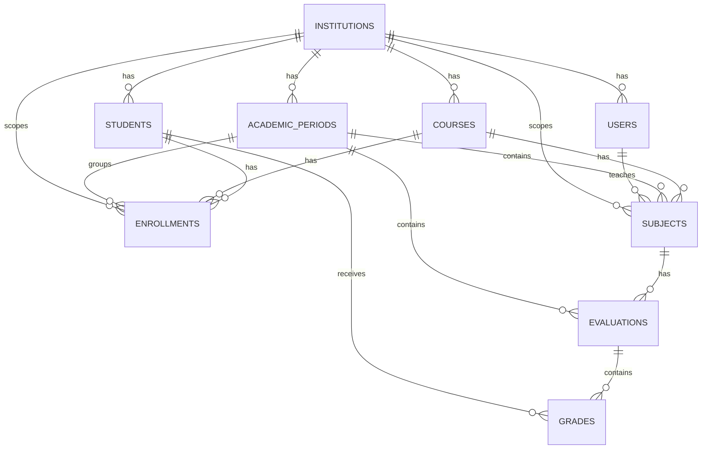

# DATABASE.md — Taruca Módulo de Calificaciones

Documento técnico de base de datos para el módulo de calificaciones de Taruca.

Este documento describe el modelo relacional, reglas de integridad, convenciones, migraciones, seeds, consultas principales, decisiones de diseño y consideraciones para evolucionar la solución desde SQLite local hacia una base productiva como PostgreSQL.

---

## Índice

- [1. Objetivo del documento](#1-objetivo-del-documento)
- [2. Contexto del proyecto](#2-contexto-del-proyecto)
- [3. Motor de base de datos](#3-motor-de-base-de-datos)
- [4. Ubicación de la base local](#4-ubicación-de-la-base-local)
- [5. Variables de entorno relacionadas](#5-variables-de-entorno-relacionadas)
- [6. Principios de diseño](#6-principios-de-diseño)
- [7. Convenciones de nombres](#7-convenciones-de-nombres)
- [8. Convención de IDs](#8-convención-de-ids)
- [9. Convención de fechas](#9-convención-de-fechas)
- [10. Modelo de dominio persistido](#10-modelo-de-dominio-persistido)
- [11. Diagrama entidad-relación](#11-diagrama-entidad-relación)
- [12. Resumen de tablas](#12-resumen-de-tablas)
- [13. Esquema detallado](#13-esquema-detallado)
- [14. Relaciones e invariantes](#14-relaciones-e-invariantes)
- [15. Reglas de negocio protegidas por datos](#15-reglas-de-negocio-protegidas-por-datos)
- [16. Índices recomendados](#16-índices-recomendados)
- [17. Migración inicial sugerida](#17-migración-inicial-sugerida)
- [18. Seeds de desarrollo](#18-seeds-de-desarrollo)
- [19. Consultas principales del módulo](#19-consultas-principales-del-módulo)
- [20. Transacciones](#20-transacciones)
- [21. Multi-tenant por institución](#21-multi-tenant-por-institución)
- [22. Autorización y base de datos](#22-autorización-y-base-de-datos)
- [23. Borrado de datos](#23-borrado-de-datos)
- [24. Validaciones por capa](#24-validaciones-por-capa)
- [25. Consideraciones específicas de SQLite](#25-consideraciones-específicas-de-sqlite)
- [26. Estrategia para PostgreSQL en producción](#26-estrategia-para-postgresql-en-producción)
- [27. Operación local](#27-operación-local)
- [28. Testing de base de datos](#28-testing-de-base-de-datos)
- [29. Checklist de implementación](#29-checklist-de-implementación)
- [30. Mejoras futuras](#30-mejoras-futuras)

---

## 1. Objetivo del documento

El objetivo de este archivo es documentar de forma profesional la base de datos del proyecto, dejando claro:

- Qué entidades se persisten.
- Cómo se relacionan las tablas.
- Qué restricciones protegen la integridad de los datos.
- Qué decisiones de modelado se tomaron y por qué.
- Qué reglas se validan en base de datos, backend y frontend.
- Cómo inicializar y reiniciar la base local.
- Cómo evolucionar el modelo si el proyecto pasa a producción.

Este documento complementa el `README.md` general del proyecto y sirve como referencia para implementar entidades TypeORM, migraciones, seeds, servicios y tests.

---

## 2. Contexto del proyecto

Taruca es una plataforma SaaS para instituciones educativas chilenas.

El módulo de calificaciones permite que:

- Profesores registren notas de sus asignaturas.
- Directivos revisen rendimiento académico.
- Alumnos estén inscritos en cursos por período académico.
- Asignaturas pertenezcan a un curso y a un período.
- Las calificaciones se registren en escala chilena de `1.0` a `7.0`.
- El sistema calcule promedio por alumno, asignatura y período.
- Los períodos puedan estar abiertos o cerrados.
- Las operaciones de escritura se bloqueen si el período está cerrado.

El modelo busca ser suficientemente simple para la prueba técnica, pero con decisiones coherentes para un producto real.

---

## 3. Motor de base de datos

### Motor usado en desarrollo

```txt
SQLite
```

SQLite se usa porque:

- No requiere instalar un motor externo.
- No requiere Docker.
- Permite ejecutar el proyecto con baja fricción.
- Es suficiente para demostrar persistencia, relaciones, validaciones e índices.
- Facilita la revisión técnica local.

### ORM

```txt
TypeORM
```

TypeORM se usa para:

- Mapear entidades TypeScript a tablas.
- Definir relaciones entre entidades.
- Ejecutar migraciones.
- Crear consultas con repositorios o QueryBuilder.
- Facilitar tests unitarios y de integración.

### Motor recomendado para producción

```txt
PostgreSQL
```

SQLite es apropiado para la prueba técnica, pero en un SaaS real se recomienda PostgreSQL por:

- Mejor soporte de concurrencia.
- Tipos estrictos.
- Mejor manejo de transacciones concurrentes.
- Mejor soporte de índices avanzados.
- Soporte nativo para UUID, JSONB, locks, constraints y extensiones.

---

## 4. Ubicación de la base local

La base SQLite local se almacena en:

```txt
backend/data/taruca.sqlite
```

Archivos asociados que pueden aparecer durante ejecución:

```txt
backend/data/taruca.sqlite
backend/data/taruca.sqlite-shm
backend/data/taruca.sqlite-wal
```

Estos archivos no deben versionarse.

`.gitignore` recomendado:

```gitignore
backend/data/*.sqlite
backend/data/*.sqlite-shm
backend/data/*.sqlite-wal
```

Se recomienda versionar solo:

```txt
backend/data/.gitkeep
```

Así se conserva la carpeta `data/` sin subir bases locales generadas.

---

## 5. Variables de entorno relacionadas

Archivo sugerido:

```txt
backend/.env
```

Ejemplo:

```env
DATABASE_TYPE=sqlite
DATABASE_PATH=./data/taruca.sqlite
DATABASE_LOGGING=false
DATABASE_SYNCHRONIZE=false
SEED_ON_BOOTSTRAP=true
```

### Descripción

| Variable | Valor sugerido | Descripción |
|---|---|---|
| `DATABASE_TYPE` | `sqlite` | Motor usado por TypeORM. |
| `DATABASE_PATH` | `./data/taruca.sqlite` | Ruta relativa desde `backend/`. |
| `DATABASE_LOGGING` | `false` | Activa logs SQL de TypeORM. Útil para debug. |
| `DATABASE_SYNCHRONIZE` | `false` | Debe estar en `false` si se usan migraciones. |
| `SEED_ON_BOOTSTRAP` | `true` | Carga datos demo al iniciar en desarrollo. |

### Recomendación importante

Para una entrega profesional, usar:

```env
DATABASE_SYNCHRONIZE=false
```

Y preferir migraciones explícitas.

`TypeORM synchronize: true` puede ser útil durante prototipado, pero no es recomendable como estado final porque modifica el esquema automáticamente y puede causar pérdida de datos.

---

## 6. Principios de diseño

El modelo de datos sigue estos principios:

### 6.1 Separar conceptos académicos

No se mezcla una evaluación con una nota.

- `evaluations` representa la columna del libro de clases: `Prueba 1`, `Control 1`, `Trabajo práctico`.
- `grades` representa la nota de un alumno en una evaluación específica.

Esto evita duplicar nombres de evaluaciones por cada alumno y facilita construir una grilla alumno por evaluación.

### 6.2 Mantener coherencia por institución

Todas las entidades principales tienen relación directa o indirecta con una institución.

El límite de acceso de datos es:

```txt
institution_id
```

Esto permite simular comportamiento multi-tenant desde el inicio.

### 6.3 No sobrediseñar el alcance

El proyecto no implementa:

- Ponderaciones.
- Tipos de evaluación.
- Auditoría histórica.
- Soft delete obligatorio.
- Importaciones masivas.

Estas mejoras se documentan como evolución futura.

### 6.4 Proteger reglas críticas en más de una capa

Las reglas importantes se validan en:

- Frontend: mejor experiencia de usuario.
- Backend: seguridad e integridad.
- Base de datos: última línea de defensa.

Ejemplo:

```txt
1.0 <= score <= 7.0
```

Debe validarse con:

- Angular Reactive Forms.
- DTOs con `class-validator`.
- Servicio de dominio.
- `CHECK` en base de datos cuando sea posible.

### 6.5 Preferir consistencia sobre borrado agresivo

La información académica es sensible.

Por eso se recomienda bloquear eliminaciones peligrosas cuando existan datos dependientes, por ejemplo:

- No eliminar una evaluación si tiene calificaciones.
- No eliminar un alumno con notas históricas.
- No eliminar un curso con asignaturas o matrículas asociadas.

Para esta prueba puede bastar con `RESTRICT` y errores `409 Conflict` desde el servicio.

---

## 7. Convenciones de nombres

### Tablas

Usar plural en `snake_case`:

```txt
institutions
academic_periods
users
courses
students
enrollments
subjects
evaluations
grades
```

### Columnas

Usar `snake_case`:

```txt
institution_id
academic_period_id
created_at
updated_at
is_open
first_name
last_name
```

### Entidades TypeORM

Usar `PascalCase`:

```txt
Institution
AcademicPeriod
User
Course
Student
Enrollment
Subject
Evaluation
Grade
```

### Propiedades TypeScript

Usar `camelCase`:

```ts
institutionId
academicPeriodId
createdAt
updatedAt
isOpen
firstName
lastName
```

### Índices

Usar prefijo según tipo:

```txt
idx_    índice normal
uq_     índice único
fk_     foreign key, si se nombra explícitamente
chk_    check constraint, si se nombra explícitamente
```

Ejemplos:

```txt
idx_subjects_course_period
uq_grades_student_evaluation
chk_grades_score_range
```

---

## 8. Convención de IDs

Todos los IDs principales deben ser UUID.

### Tipo en TypeScript

```ts
string
```

### Tipo en SQLite

```sql
TEXT
```

### Tipo recomendado en PostgreSQL

```sql
UUID
```

### Motivos para usar UUID

- Son consistentes con validaciones `@IsUUID()`.
- Evitan colisiones en escenarios distribuidos.
- Son adecuados para un SaaS multi-tenant.
- No exponen conteos internos como IDs autoincrementales.

### Ejemplo

```txt
11111111-1111-4111-8111-111111111111
```

### Nota sobre seeds

Los seeds pueden usar UUIDs fijos para facilitar pruebas reproducibles.

Ejemplo:

```ts
export const DEMO_INSTITUTION_ID = '11111111-1111-4111-8111-111111111111';
```

Esto permite que el frontend o las pruebas usen IDs conocidos sin depender de datos aleatorios.

---

## 9. Convención de fechas

Todas las tablas principales incluyen:

```txt
created_at
updated_at
```

### Tipo en SQLite

```sql
DATETIME
```

SQLite almacena fechas como texto ISO, número o real internamente. TypeORM puede manejarlo como `datetime`.

### Tipo en TypeScript

```ts
Date
```

### Reglas

- `created_at` se asigna al crear el registro.
- `updated_at` se actualiza automáticamente al modificar el registro.
- Las fechas se almacenan idealmente en UTC.
- El frontend decide formato visual según localización.

### Decoradores TypeORM sugeridos

```ts
@CreateDateColumn({ name: 'created_at' })
createdAt: Date;

@UpdateDateColumn({ name: 'updated_at' })
updatedAt: Date;
```

---

## 10. Modelo de dominio persistido

### Entidades principales

| Entidad | Tabla | Responsabilidad |
|---|---|---|
| `Institution` | `institutions` | Representa el tenant o colegio. |
| `User` | `users` | Usuario con rol dentro de una institución. |
| `AcademicPeriod` | `academic_periods` | Período académico abierto o cerrado. |
| `Course` | `courses` | Curso de una institución. |
| `Student` | `students` | Alumno de una institución. |
| `Enrollment` | `enrollments` | Inscripción de alumno en curso y período. |
| `Subject` | `subjects` | Asignatura asociada a curso, período y profesor. |
| `Evaluation` | `evaluations` | Evaluación o columna del libro de clases. |
| `Grade` | `grades` | Nota de un alumno en una evaluación. |

### Flujo lógico

```txt
Institution
  ├─ Users
  ├─ Courses
  │   └─ Subjects
  │       └─ Evaluations
  │           └─ Grades
  ├─ Students
  │   └─ Enrollments
  └─ AcademicPeriods
```

### Relación central para el libro de clases

```txt
Course + AcademicPeriod -> Subject -> Evaluation -> Grade
Student + Enrollment ----^                       ^
```

Un alumno aparece en el libro de clases de una asignatura si:

1. Está inscrito en el curso de la asignatura.
2. La inscripción corresponde al mismo período académico de la asignatura.
3. Pertenece a la misma institución.

---

## 11. Diagrama entidad-relación



---

## 12. Resumen de tablas

| Tabla | Propósito | Datos críticos |
|---|---|---|
| `institutions` | Colegios o instituciones. | `name` |
| `users` | Usuarios del sistema. | `role`, `institution_id` |
| `academic_periods` | Semestres o años académicos. | `is_open`, `year` |
| `courses` | Cursos. | `name`, `institution_id` |
| `students` | Alumnos. | `first_name`, `last_name`, `rut` |
| `enrollments` | Matrícula de alumno por curso/período. | `student_id`, `course_id`, `academic_period_id` |
| `subjects` | Asignaturas. | `course_id`, `academic_period_id`, `teacher_id` |
| `evaluations` | Columnas del libro de clases. | `name`, `subject_id`, `order` |
| `grades` | Calificaciones numéricas. | `student_id`, `evaluation_id`, `score` |

---

## 13. Esquema detallado

### 13.1 `institutions`

Representa una institución educativa.

```sql
CREATE TABLE institutions (
  id TEXT PRIMARY KEY,
  name TEXT NOT NULL,
  created_at DATETIME NOT NULL DEFAULT CURRENT_TIMESTAMP,
  updated_at DATETIME NOT NULL DEFAULT CURRENT_TIMESTAMP
);
```

| Columna | Tipo SQLite | Nulo | Descripción |
|---|---:|:---:|---|
| `id` | `TEXT` | No | UUID de la institución. |
| `name` | `TEXT` | No | Nombre de la institución. |
| `created_at` | `DATETIME` | No | Fecha de creación. |
| `updated_at` | `DATETIME` | No | Fecha de última actualización. |

Consideraciones:

- En la prueba se usará una institución demo.
- En producción esta tabla sería el punto base del aislamiento multi-tenant.

---

### 13.2 `users`

Representa usuarios de la institución.

```sql
CREATE TABLE users (
  id TEXT PRIMARY KEY,
  name TEXT NOT NULL,
  email TEXT NOT NULL,
  role TEXT NOT NULL CHECK(role IN ('DIRECTOR', 'UTP', 'TEACHER')),
  institution_id TEXT NOT NULL,
  created_at DATETIME NOT NULL DEFAULT CURRENT_TIMESTAMP,
  updated_at DATETIME NOT NULL DEFAULT CURRENT_TIMESTAMP,
  CONSTRAINT fk_users_institution
    FOREIGN KEY (institution_id)
    REFERENCES institutions(id)
    ON DELETE RESTRICT
);

CREATE UNIQUE INDEX uq_users_email ON users(email);
CREATE INDEX idx_users_institution ON users(institution_id);
CREATE INDEX idx_users_role ON users(role);
```

| Columna | Tipo SQLite | Nulo | Descripción |
|---|---:|:---:|---|
| `id` | `TEXT` | No | UUID del usuario. |
| `name` | `TEXT` | No | Nombre visible del usuario. |
| `email` | `TEXT` | No | Correo único. |
| `role` | `TEXT` | No | Rol del usuario. |
| `institution_id` | `TEXT` | No | Institución a la que pertenece. |
| `created_at` | `DATETIME` | No | Fecha de creación. |
| `updated_at` | `DATETIME` | No | Fecha de actualización. |

Roles permitidos:

```txt
DIRECTOR
UTP
TEACHER
```

Consideraciones:

- Para la prueba no se implementa login real.
- El usuario actual se resuelve desde un JWT mockeado.
- El rol se usa para filtrar permisos en backend.

---

### 13.3 `academic_periods`

Representa un período académico.

```sql
CREATE TABLE academic_periods (
  id TEXT PRIMARY KEY,
  name TEXT NOT NULL,
  year INTEGER NOT NULL,
  is_open BOOLEAN NOT NULL DEFAULT 1,
  institution_id TEXT NOT NULL,
  created_at DATETIME NOT NULL DEFAULT CURRENT_TIMESTAMP,
  updated_at DATETIME NOT NULL DEFAULT CURRENT_TIMESTAMP,
  CONSTRAINT fk_academic_periods_institution
    FOREIGN KEY (institution_id)
    REFERENCES institutions(id)
    ON DELETE RESTRICT
);

CREATE INDEX idx_academic_periods_institution
ON academic_periods(institution_id);

CREATE INDEX idx_academic_periods_year
ON academic_periods(year);
```

| Columna | Tipo SQLite | Nulo | Descripción |
|---|---:|:---:|---|
| `id` | `TEXT` | No | UUID del período. |
| `name` | `TEXT` | No | Nombre, por ejemplo `1er semestre 2025`. |
| `year` | `INTEGER` | No | Año académico. |
| `is_open` | `BOOLEAN` | No | Indica si permite escritura. |
| `institution_id` | `TEXT` | No | Institución del período. |
| `created_at` | `DATETIME` | No | Fecha de creación. |
| `updated_at` | `DATETIME` | No | Fecha de actualización. |

Regla clave:

```txt
Si is_open = false, no se pueden crear, editar ni eliminar evaluaciones o calificaciones del período.
```

Esta regla se valida principalmente en el servicio, porque requiere navegar relaciones desde evaluación/asignatura/período.

---

### 13.4 `courses`

Representa cursos de una institución.

```sql
CREATE TABLE courses (
  id TEXT PRIMARY KEY,
  name TEXT NOT NULL,
  institution_id TEXT NOT NULL,
  created_at DATETIME NOT NULL DEFAULT CURRENT_TIMESTAMP,
  updated_at DATETIME NOT NULL DEFAULT CURRENT_TIMESTAMP,
  CONSTRAINT fk_courses_institution
    FOREIGN KEY (institution_id)
    REFERENCES institutions(id)
    ON DELETE RESTRICT
);

CREATE INDEX idx_courses_institution
ON courses(institution_id);

CREATE UNIQUE INDEX uq_courses_institution_name
ON courses(institution_id, name);
```

| Columna | Tipo SQLite | Nulo | Descripción |
|---|---:|:---:|---|
| `id` | `TEXT` | No | UUID del curso. |
| `name` | `TEXT` | No | Nombre del curso, por ejemplo `1° Medio A`. |
| `institution_id` | `TEXT` | No | Institución del curso. |
| `created_at` | `DATETIME` | No | Fecha de creación. |
| `updated_at` | `DATETIME` | No | Fecha de actualización. |

Consideraciones:

- El nombre es único dentro de una institución.
- Podrían existir cursos con igual nombre en instituciones distintas.

---

### 13.5 `students`

Representa alumnos de una institución.

```sql
CREATE TABLE students (
  id TEXT PRIMARY KEY,
  first_name TEXT NOT NULL,
  last_name TEXT NOT NULL,
  rut TEXT,
  institution_id TEXT NOT NULL,
  created_at DATETIME NOT NULL DEFAULT CURRENT_TIMESTAMP,
  updated_at DATETIME NOT NULL DEFAULT CURRENT_TIMESTAMP,
  CONSTRAINT fk_students_institution
    FOREIGN KEY (institution_id)
    REFERENCES institutions(id)
    ON DELETE RESTRICT
);

CREATE INDEX idx_students_institution
ON students(institution_id);

CREATE INDEX idx_students_last_name
ON students(last_name);

CREATE UNIQUE INDEX uq_students_institution_rut
ON students(institution_id, rut)
WHERE rut IS NOT NULL;
```

| Columna | Tipo SQLite | Nulo | Descripción |
|---|---:|:---:|---|
| `id` | `TEXT` | No | UUID del alumno. |
| `first_name` | `TEXT` | No | Nombres del alumno. |
| `last_name` | `TEXT` | No | Apellidos del alumno. |
| `rut` | `TEXT` | Sí | RUT del alumno. |
| `institution_id` | `TEXT` | No | Institución del alumno. |
| `created_at` | `DATETIME` | No | Fecha de creación. |
| `updated_at` | `DATETIME` | No | Fecha de actualización. |

Consideraciones:

- `rut` se deja nullable para simplificar datos demo.
- Si se informa `rut`, debe ser único dentro de la institución.
- La validación formal del RUT queda fuera del alcance base.

---

### 13.6 `enrollments`

Representa la inscripción de un alumno en un curso durante un período académico.

```sql
CREATE TABLE enrollments (
  id TEXT PRIMARY KEY,
  student_id TEXT NOT NULL,
  course_id TEXT NOT NULL,
  academic_period_id TEXT NOT NULL,
  institution_id TEXT NOT NULL,
  created_at DATETIME NOT NULL DEFAULT CURRENT_TIMESTAMP,
  updated_at DATETIME NOT NULL DEFAULT CURRENT_TIMESTAMP,
  CONSTRAINT fk_enrollments_student
    FOREIGN KEY (student_id)
    REFERENCES students(id)
    ON DELETE RESTRICT,
  CONSTRAINT fk_enrollments_course
    FOREIGN KEY (course_id)
    REFERENCES courses(id)
    ON DELETE RESTRICT,
  CONSTRAINT fk_enrollments_academic_period
    FOREIGN KEY (academic_period_id)
    REFERENCES academic_periods(id)
    ON DELETE RESTRICT,
  CONSTRAINT fk_enrollments_institution
    FOREIGN KEY (institution_id)
    REFERENCES institutions(id)
    ON DELETE RESTRICT
);

CREATE UNIQUE INDEX uq_enrollments_student_period
ON enrollments(student_id, academic_period_id);

CREATE INDEX idx_enrollments_course_period
ON enrollments(course_id, academic_period_id);

CREATE INDEX idx_enrollments_institution
ON enrollments(institution_id);
```

| Columna | Tipo SQLite | Nulo | Descripción |
|---|---:|:---:|---|
| `id` | `TEXT` | No | UUID de la matrícula. |
| `student_id` | `TEXT` | No | Alumno inscrito. |
| `course_id` | `TEXT` | No | Curso al que pertenece. |
| `academic_period_id` | `TEXT` | No | Período académico. |
| `institution_id` | `TEXT` | No | Institución de la matrícula. |
| `created_at` | `DATETIME` | No | Fecha de creación. |
| `updated_at` | `DATETIME` | No | Fecha de actualización. |

Regla:

```txt
Un alumno solo puede estar inscrito en un curso por período académico.
```

Por eso existe:

```sql
UNIQUE(student_id, academic_period_id)
```

Consideración:

- Si en el futuro se permite doble matrícula, esta restricción debería revisarse.

---

### 13.7 `subjects`

Representa una asignatura impartida en un curso y período.

```sql
CREATE TABLE subjects (
  id TEXT PRIMARY KEY,
  name TEXT NOT NULL,
  course_id TEXT NOT NULL,
  academic_period_id TEXT NOT NULL,
  teacher_id TEXT NOT NULL,
  institution_id TEXT NOT NULL,
  created_at DATETIME NOT NULL DEFAULT CURRENT_TIMESTAMP,
  updated_at DATETIME NOT NULL DEFAULT CURRENT_TIMESTAMP,
  CONSTRAINT fk_subjects_course
    FOREIGN KEY (course_id)
    REFERENCES courses(id)
    ON DELETE RESTRICT,
  CONSTRAINT fk_subjects_academic_period
    FOREIGN KEY (academic_period_id)
    REFERENCES academic_periods(id)
    ON DELETE RESTRICT,
  CONSTRAINT fk_subjects_teacher
    FOREIGN KEY (teacher_id)
    REFERENCES users(id)
    ON DELETE RESTRICT,
  CONSTRAINT fk_subjects_institution
    FOREIGN KEY (institution_id)
    REFERENCES institutions(id)
    ON DELETE RESTRICT
);

CREATE INDEX idx_subjects_course_period
ON subjects(course_id, academic_period_id);

CREATE INDEX idx_subjects_teacher
ON subjects(teacher_id);

CREATE INDEX idx_subjects_institution
ON subjects(institution_id);

CREATE UNIQUE INDEX uq_subjects_course_period_name
ON subjects(course_id, academic_period_id, name);
```

| Columna | Tipo SQLite | Nulo | Descripción |
|---|---:|:---:|---|
| `id` | `TEXT` | No | UUID de la asignatura. |
| `name` | `TEXT` | No | Nombre, por ejemplo `Matemática`. |
| `course_id` | `TEXT` | No | Curso asociado. |
| `academic_period_id` | `TEXT` | No | Período académico. |
| `teacher_id` | `TEXT` | No | Profesor responsable. |
| `institution_id` | `TEXT` | No | Institución. |
| `created_at` | `DATETIME` | No | Fecha de creación. |
| `updated_at` | `DATETIME` | No | Fecha de actualización. |

Reglas:

- La asignatura pertenece a un solo curso.
- La asignatura pertenece a un solo período.
- La asignatura tiene un profesor responsable.
- Un profesor con rol `TEACHER` solo puede gestionar sus propias asignaturas.
- Director y UTP pueden ver y gestionar asignaturas de su institución.

---

### 13.8 `evaluations`

Representa una evaluación, es decir, una columna del libro de clases.

Ejemplos:

```txt
Prueba 1
Control 1
Trabajo práctico
```

```sql
CREATE TABLE evaluations (
  id TEXT PRIMARY KEY,
  name TEXT NOT NULL,
  description TEXT,
  subject_id TEXT NOT NULL,
  academic_period_id TEXT NOT NULL,
  display_order INTEGER NOT NULL DEFAULT 0,
  created_at DATETIME NOT NULL DEFAULT CURRENT_TIMESTAMP,
  updated_at DATETIME NOT NULL DEFAULT CURRENT_TIMESTAMP,
  CONSTRAINT fk_evaluations_subject
    FOREIGN KEY (subject_id)
    REFERENCES subjects(id)
    ON DELETE RESTRICT,
  CONSTRAINT fk_evaluations_academic_period
    FOREIGN KEY (academic_period_id)
    REFERENCES academic_periods(id)
    ON DELETE RESTRICT
);

CREATE UNIQUE INDEX uq_evaluations_subject_period_name
ON evaluations(subject_id, academic_period_id, name);

CREATE INDEX idx_evaluations_subject_order
ON evaluations(subject_id, display_order);

CREATE INDEX idx_evaluations_period
ON evaluations(academic_period_id);
```

| Columna | Tipo SQLite | Nulo | Descripción |
|---|---:|:---:|---|
| `id` | `TEXT` | No | UUID de la evaluación. |
| `name` | `TEXT` | No | Nombre visible de la evaluación. |
| `description` | `TEXT` | Sí | Descripción opcional. |
| `subject_id` | `TEXT` | No | Asignatura a la que pertenece. |
| `academic_period_id` | `TEXT` | No | Período académico. |
| `display_order` | `INTEGER` | No | Orden de columna en la grilla. |
| `created_at` | `DATETIME` | No | Fecha de creación. |
| `updated_at` | `DATETIME` | No | Fecha de actualización. |

### Nota sobre `display_order`

Se usa `display_order` en base de datos para evitar conflictos con palabras reservadas o ambiguas como `order`.

En TypeScript se puede mapear como:

```ts
@Column({ name: 'display_order', type: 'integer', default: 0 })
order: number;
```

### Por qué existe `Evaluation`

El enunciado pide que cada calificación pueda tener nombre o descripción, por ejemplo `Prueba 1` o `Control`.

En este diseño, ese nombre se modela en `evaluations`, no en `grades`.

Motivo:

- `Prueba 1` es una evaluación común para todos los alumnos.
- Cada alumno tiene una nota distinta para esa evaluación.
- Si el nombre viviera en `grades`, se repetiría una vez por alumno.
- Separar ambos conceptos permite construir una grilla natural: alumnos en filas y evaluaciones en columnas.

---

### 13.9 `grades`

Representa la nota obtenida por un alumno en una evaluación.

```sql
CREATE TABLE grades (
  id TEXT PRIMARY KEY,
  student_id TEXT NOT NULL,
  evaluation_id TEXT NOT NULL,
  score NUMERIC NOT NULL CHECK(score >= 1.0 AND score <= 7.0),
  created_at DATETIME NOT NULL DEFAULT CURRENT_TIMESTAMP,
  updated_at DATETIME NOT NULL DEFAULT CURRENT_TIMESTAMP,
  CONSTRAINT fk_grades_student
    FOREIGN KEY (student_id)
    REFERENCES students(id)
    ON DELETE RESTRICT,
  CONSTRAINT fk_grades_evaluation
    FOREIGN KEY (evaluation_id)
    REFERENCES evaluations(id)
    ON DELETE RESTRICT
);

CREATE UNIQUE INDEX uq_grades_student_evaluation
ON grades(student_id, evaluation_id);

CREATE INDEX idx_grades_student
ON grades(student_id);

CREATE INDEX idx_grades_evaluation
ON grades(evaluation_id);
```

| Columna | Tipo SQLite | Nulo | Descripción |
|---|---:|:---:|---|
| `id` | `TEXT` | No | UUID de la calificación. |
| `student_id` | `TEXT` | No | Alumno calificado. |
| `evaluation_id` | `TEXT` | No | Evaluación asociada. |
| `score` | `NUMERIC` | No | Nota entre `1.0` y `7.0`. |
| `created_at` | `DATETIME` | No | Fecha de creación. |
| `updated_at` | `DATETIME` | No | Fecha de actualización. |

Reglas:

- Una nota debe estar entre `1.0` y `7.0`.
- Un alumno no puede tener dos notas para la misma evaluación.
- La asignatura y período de la nota se obtienen desde `evaluation -> subject -> academic_period`.
- Antes de crear una nota, se valida que el alumno esté inscrito en el curso de la asignatura.

---

## 14. Relaciones e invariantes

### 14.1 Institución como límite de datos

Todas las consultas deben quedar restringidas a la institución del usuario actual.

Ejemplo lógico:

```txt
currentUser.institutionId = subject.institution_id
```

Esto se valida en servicios y queries.

### 14.2 Coherencia de período entre asignatura y evaluación

Una evaluación tiene:

```txt
subject_id
academic_period_id
```

La asignatura también tiene:

```txt
academic_period_id
```

Invariante:

```txt
evaluations.academic_period_id = subjects.academic_period_id
```

Esta regla no se puede expresar fácilmente como `CHECK` en SQLite porque depende de otra tabla.

Debe validarse en el servicio al crear o actualizar una evaluación.

### 14.3 Coherencia de institución entre entidades

Ejemplo:

```txt
subject.institution_id = course.institution_id
subject.institution_id = teacher.institution_id
subject.institution_id = academic_period.institution_id
```

También debe validarse en servicios, especialmente en operaciones de escritura.

### 14.4 Alumno pertenece al curso de la asignatura

Antes de crear una nota:

```txt
student -> enrollment -> course
subject -> course
```

Debe cumplirse:

```txt
enrollments.student_id = grade.student_id
enrollments.course_id = subject.course_id
enrollments.academic_period_id = subject.academic_period_id
```

Si no se cumple, responder:

```http
400 Bad Request
```

### 14.5 Una nota por alumno y evaluación

Protegido por:

```sql
UNIQUE(student_id, evaluation_id)
```

Si se intenta duplicar, responder:

```http
409 Conflict
```

### 14.6 Período cerrado bloquea escritura

Si:

```txt
academic_periods.is_open = false
```

Entonces se bloquea:

- Crear calificaciones.
- Editar calificaciones.
- Eliminar calificaciones.
- Crear evaluaciones.
- Editar evaluaciones.
- Eliminar evaluaciones.

Responder:

```http
403 Forbidden
```

---

## 15. Reglas de negocio protegidas por datos

| Regla | Base de datos | Backend | Frontend |
|---|:---:|:---:|:---:|
| Nota entre `1.0` y `7.0` | Sí, `CHECK` | Sí | Sí |
| Nota con máximo un decimal | Parcial | Sí | Sí |
| Una nota por alumno/evaluación | Sí, `UNIQUE` | Sí | No aplica |
| Período cerrado bloquea escritura | No directo | Sí | Sí, modo lectura |
| Alumno pertenece al curso | No directo | Sí | No confiable |
| Usuario pertenece a institución | No directo | Sí | No confiable |
| Profesor solo gestiona sus asignaturas | No directo | Sí | No confiable |
| Promedio simple | No aplica | Sí | Solo visualización |

### Nota sobre máximo un decimal

SQLite puede almacenar números con más decimales aunque la columna sea `NUMERIC`.

Por eso esta regla debe validarse principalmente en DTO y servicio:

```ts
@IsNumber({ maxDecimalPlaces: 1 })
```

Si se quiere reforzar en SQLite, se puede usar una restricción adicional:

```sql
CHECK(score * 10 = CAST(score * 10 AS INTEGER))
```

Sin embargo, para evitar problemas de precisión decimal, se recomienda dejar esta validación en backend.

---

## 16. Índices recomendados

### Índices por tabla

```sql
-- users
CREATE UNIQUE INDEX uq_users_email ON users(email);
CREATE INDEX idx_users_institution ON users(institution_id);
CREATE INDEX idx_users_role ON users(role);

-- academic_periods
CREATE INDEX idx_academic_periods_institution ON academic_periods(institution_id);
CREATE INDEX idx_academic_periods_year ON academic_periods(year);

-- courses
CREATE INDEX idx_courses_institution ON courses(institution_id);
CREATE UNIQUE INDEX uq_courses_institution_name ON courses(institution_id, name);

-- students
CREATE INDEX idx_students_institution ON students(institution_id);
CREATE INDEX idx_students_last_name ON students(last_name);
CREATE UNIQUE INDEX uq_students_institution_rut ON students(institution_id, rut) WHERE rut IS NOT NULL;

-- enrollments
CREATE UNIQUE INDEX uq_enrollments_student_period ON enrollments(student_id, academic_period_id);
CREATE INDEX idx_enrollments_course_period ON enrollments(course_id, academic_period_id);
CREATE INDEX idx_enrollments_institution ON enrollments(institution_id);

-- subjects
CREATE INDEX idx_subjects_course_period ON subjects(course_id, academic_period_id);
CREATE INDEX idx_subjects_teacher ON subjects(teacher_id);
CREATE INDEX idx_subjects_institution ON subjects(institution_id);
CREATE UNIQUE INDEX uq_subjects_course_period_name ON subjects(course_id, academic_period_id, name);

-- evaluations
CREATE UNIQUE INDEX uq_evaluations_subject_period_name ON evaluations(subject_id, academic_period_id, name);
CREATE INDEX idx_evaluations_subject_order ON evaluations(subject_id, display_order);
CREATE INDEX idx_evaluations_period ON evaluations(academic_period_id);

-- grades
CREATE UNIQUE INDEX uq_grades_student_evaluation ON grades(student_id, evaluation_id);
CREATE INDEX idx_grades_student ON grades(student_id);
CREATE INDEX idx_grades_evaluation ON grades(evaluation_id);
```

### Justificación de índices principales

| Índice | Motivo |
|---|---|
| `idx_subjects_course_period` | Cargar asignaturas por curso y período. |
| `idx_subjects_teacher` | Filtrar asignaturas visibles para un profesor. |
| `idx_enrollments_course_period` | Obtener alumnos del libro de clases. |
| `idx_evaluations_subject_order` | Renderizar columnas de evaluación ordenadas. |
| `uq_grades_student_evaluation` | Evitar notas duplicadas. |
| `idx_grades_student` | Consultar notas de un alumno. |
| `idx_grades_evaluation` | Cargar notas por evaluación. |

---

## 17. Migración inicial sugerida

Archivo sugerido:

```txt
backend/src/database/migrations/1700000000000-CreateInitialSchema.ts
```

Ejemplo resumido:

```ts
import { MigrationInterface, QueryRunner } from 'typeorm';

export class CreateInitialSchema1700000000000 implements MigrationInterface {
  name = 'CreateInitialSchema1700000000000';

  public async up(queryRunner: QueryRunner): Promise<void> {
    await queryRunner.query(`PRAGMA foreign_keys = ON`);

    await queryRunner.query(`
      CREATE TABLE institutions (
        id TEXT PRIMARY KEY,
        name TEXT NOT NULL,
        created_at DATETIME NOT NULL DEFAULT CURRENT_TIMESTAMP,
        updated_at DATETIME NOT NULL DEFAULT CURRENT_TIMESTAMP
      )
    `);

    await queryRunner.query(`
      CREATE TABLE users (
        id TEXT PRIMARY KEY,
        name TEXT NOT NULL,
        email TEXT NOT NULL,
        role TEXT NOT NULL CHECK(role IN ('DIRECTOR', 'UTP', 'TEACHER')),
        institution_id TEXT NOT NULL,
        created_at DATETIME NOT NULL DEFAULT CURRENT_TIMESTAMP,
        updated_at DATETIME NOT NULL DEFAULT CURRENT_TIMESTAMP,
        FOREIGN KEY (institution_id) REFERENCES institutions(id) ON DELETE RESTRICT
      )
    `);

    await queryRunner.query(`CREATE UNIQUE INDEX uq_users_email ON users(email)`);

    // Repetir para academic_periods, courses, students, enrollments,
    // subjects, evaluations y grades.
  }

  public async down(queryRunner: QueryRunner): Promise<void> {
    await queryRunner.query(`DROP TABLE IF EXISTS grades`);
    await queryRunner.query(`DROP TABLE IF EXISTS evaluations`);
    await queryRunner.query(`DROP TABLE IF EXISTS subjects`);
    await queryRunner.query(`DROP TABLE IF EXISTS enrollments`);
    await queryRunner.query(`DROP TABLE IF EXISTS students`);
    await queryRunner.query(`DROP TABLE IF EXISTS courses`);
    await queryRunner.query(`DROP TABLE IF EXISTS academic_periods`);
    await queryRunner.query(`DROP TABLE IF EXISTS users`);
    await queryRunner.query(`DROP TABLE IF EXISTS institutions`);
  }
}
```

### Orden correcto de creación

```txt
1. institutions
2. users
3. academic_periods
4. courses
5. students
6. enrollments
7. subjects
8. evaluations
9. grades
```

### Orden correcto de eliminación

```txt
1. grades
2. evaluations
3. subjects
4. enrollments
5. students
6. courses
7. academic_periods
8. users
9. institutions
```

---

## 18. Seeds de desarrollo

Los seeds permiten revisar la aplicación sin crear datos manualmente.

Archivo sugerido:

```txt
backend/src/database/seeds/seed-dev.ts
```

### Estrategia

Los seeds deben ser idempotentes.

Esto significa que ejecutar el seed varias veces no debe duplicar datos.

Opciones:

1. Usar `upsert`.
2. Buscar por ID antes de insertar.
3. Limpiar tablas en orden controlado antes de insertar.

Para la prueba se recomienda usar UUIDs fijos y `upsert`.

### Datos demo recomendados

#### Institución

```txt
Colegio Taruca Demo
```

#### Período académico

```txt
1er semestre 2025
is_open = true
```

#### Curso

```txt
1° Medio A
```

#### Usuarios

| Nombre | Rol | Token mockeado |
|---|---|---|
| Directora Demo | `DIRECTOR` | `mock-director-token` |
| Jefa UTP Demo | `UTP` | `mock-utp-token` |
| Profesor Demo | `TEACHER` | `mock-teacher-token` |

#### Asignatura

```txt
Matemática
```

#### Alumnos

```txt
Ana Pérez
Juan Soto
Camila Rojas
Diego Fernández
Valentina Muñoz
```

#### Evaluaciones

```txt
Prueba 1
Control 1
Trabajo práctico
```

#### Calificaciones

| Alumno | Prueba 1 | Control 1 | Trabajo práctico | Promedio esperado |
|---|---:|---:|---:|---:|
| Ana Pérez | 6.0 | 5.8 | 6.2 | 6.0 |
| Juan Soto | 3.5 | 4.0 | 3.8 | 3.8 |
| Camila Rojas | 5.5 | 6.1 | 5.9 | 5.8 |
| Diego Fernández | 4.2 | 3.9 | 4.1 | 4.1 |
| Valentina Muñoz | 6.7 | 6.4 | 6.8 | 6.6 |

### Qué permite verificar el seed

- Carga inicial del libro de clases.
- Promedio calculado correctamente.
- Indicador visual para promedio bajo `4.0`.
- Edición de notas.
- Validaciones de rango.
- Comportamiento con período cerrado.
- Permisos por rol.

---

## 19. Consultas principales del módulo

### 19.1 Obtener asignaturas visibles para el usuario

#### Director o UTP

```sql
SELECT s.*
FROM subjects s
WHERE s.institution_id = :institutionId
  AND (:courseId IS NULL OR s.course_id = :courseId)
  AND (:academicPeriodId IS NULL OR s.academic_period_id = :academicPeriodId)
ORDER BY s.name ASC;
```

#### Profesor

```sql
SELECT s.*
FROM subjects s
WHERE s.institution_id = :institutionId
  AND s.teacher_id = :userId
  AND (:courseId IS NULL OR s.course_id = :courseId)
  AND (:academicPeriodId IS NULL OR s.academic_period_id = :academicPeriodId)
ORDER BY s.name ASC;
```

---

### 19.2 Obtener libro de clases

Objetivo:

```txt
Dado subjectId y academicPeriodId, retornar:
- Asignatura.
- Curso.
- Período.
- Evaluaciones ordenadas.
- Alumnos inscritos.
- Notas de cada alumno.
- Promedio.
- Indicador promedio bajo 4.0.
```

Consulta base para alumnos:

```sql
SELECT st.id,
       st.first_name,
       st.last_name
FROM enrollments e
JOIN students st ON st.id = e.student_id
JOIN subjects sb ON sb.course_id = e.course_id
WHERE sb.id = :subjectId
  AND e.academic_period_id = :academicPeriodId
  AND sb.academic_period_id = :academicPeriodId
  AND st.institution_id = :institutionId
ORDER BY st.last_name ASC, st.first_name ASC;
```

Consulta para evaluaciones:

```sql
SELECT ev.id,
       ev.name,
       ev.description,
       ev.display_order
FROM evaluations ev
WHERE ev.subject_id = :subjectId
  AND ev.academic_period_id = :academicPeriodId
ORDER BY ev.display_order ASC, ev.created_at ASC;
```

Consulta para calificaciones:

```sql
SELECT g.id,
       g.student_id,
       g.evaluation_id,
       g.score
FROM grades g
JOIN evaluations ev ON ev.id = g.evaluation_id
WHERE ev.subject_id = :subjectId
  AND ev.academic_period_id = :academicPeriodId;
```

El servicio puede armar la grilla en memoria para evitar una respuesta SQL demasiado compleja.

---

### 19.3 Calcular promedio por alumno en asignatura

```sql
SELECT g.student_id,
       AVG(g.score) AS average
FROM grades g
JOIN evaluations ev ON ev.id = g.evaluation_id
WHERE ev.subject_id = :subjectId
  AND ev.academic_period_id = :academicPeriodId
GROUP BY g.student_id;
```

Regla de negocio:

```txt
Si un alumno no tiene notas, average = null.
```

No se debe retornar `0` porque podría interpretarse como promedio real.

---

### 19.4 Listar calificaciones de un alumno en una asignatura

```sql
SELECT g.id,
       g.score,
       g.created_at,
       g.updated_at,
       ev.id AS evaluation_id,
       ev.name AS evaluation_name,
       ev.description AS evaluation_description
FROM grades g
JOIN evaluations ev ON ev.id = g.evaluation_id
WHERE g.student_id = :studentId
  AND ev.subject_id = :subjectId
  AND ev.academic_period_id = :academicPeriodId
ORDER BY ev.display_order ASC, ev.created_at ASC;
```

---

### 19.5 Validar alumno pertenece al curso de la asignatura

```sql
SELECT e.id
FROM enrollments e
JOIN subjects s ON s.course_id = e.course_id
WHERE e.student_id = :studentId
  AND s.id = :subjectId
  AND e.academic_period_id = s.academic_period_id
  AND e.institution_id = :institutionId
LIMIT 1;
```

Si no hay resultado, no se debe permitir crear la nota.

---

### 19.6 Validar período abierto desde una evaluación

```sql
SELECT ap.is_open
FROM evaluations ev
JOIN academic_periods ap ON ap.id = ev.academic_period_id
WHERE ev.id = :evaluationId;
```

Si `is_open = false`, responder:

```http
403 Forbidden
```

---

### 19.7 Detectar nota duplicada

```sql
SELECT id
FROM grades
WHERE student_id = :studentId
  AND evaluation_id = :evaluationId
LIMIT 1;
```

También está protegido por índice único.

---

## 20. Transacciones

### Cuándo usar transacciones

Usar transacciones cuando una operación escriba más de una tabla o cuando exista riesgo de inconsistencias intermedias.

Casos recomendados:

- Crear evaluación y calificaciones iniciales en lote.
- Importar notas desde archivo.
- Cerrar período y registrar auditoría futura.
- Eliminar una evaluación junto con datos asociados, si se permitiera.

### Crear o actualizar una nota

Para una operación simple sobre `grades`, no siempre es obligatorio abrir una transacción manual si se usa una única escritura.

Pero el servicio debe ejecutar validaciones antes:

1. Buscar evaluación.
2. Buscar asignatura y período.
3. Verificar período abierto.
4. Verificar permisos.
5. Verificar matrícula del alumno.
6. Crear o actualizar nota.

Si el flujo evoluciona para recalcular y persistir resúmenes, entonces sí conviene transacción.

### Ejemplo TypeORM

```ts
await this.dataSource.transaction(async (manager) => {
  const gradeRepository = manager.getRepository(Grade);

  const grade = gradeRepository.create({
    studentId,
    evaluationId,
    score,
  });

  await gradeRepository.save(grade);
});
```

---

## 21. Multi-tenant por institución

### Estrategia actual

El aislamiento se implementa con:

```txt
institution_id
```

en las entidades principales.

Cada request se resuelve con un usuario actual:

```ts
currentUser.institutionId
```

Toda consulta debe incluir ese valor.

### Regla

Nunca confiar en `institutionId` enviado por el cliente.

El `institutionId` válido siempre debe salir del token o del usuario actual autenticado.

### Ejemplo incorrecto

```ts
// Incorrecto
const institutionId = dto.institutionId;
```

### Ejemplo correcto

```ts
// Correcto
const institutionId = currentUser.institutionId;
```

### Consultas protegidas

Todas las queries de lectura deben filtrar por institución directa o indirectamente.

Ejemplo:

```sql
SELECT *
FROM subjects
WHERE institution_id = :currentUserInstitutionId;
```

### Escrituras protegidas

Antes de crear una nota, validar que todos los elementos pertenecen a la misma institución:

```txt
student.institution_id
subject.institution_id
teacher.institution_id
currentUser.institutionId
```

---

## 22. Autorización y base de datos

La base de datos guarda los datos necesarios para autorización, pero la decisión de autorización vive en backend.

### Datos usados para autorización

| Dato | Tabla | Uso |
|---|---|---|
| `users.role` | `users` | Determina permisos generales. |
| `users.institution_id` | `users` | Limita tenant. |
| `subjects.teacher_id` | `subjects` | Valida profesor dueño de asignatura. |
| `academic_periods.is_open` | `academic_periods` | Bloquea escrituras. |

### Reglas por rol

| Acción | DIRECTOR | UTP | TEACHER |
|---|:---:|:---:|:---:|
| Ver asignaturas de la institución | Sí | Sí | Solo propias |
| Ver libro de clases | Sí | Sí | Solo propias |
| Crear nota | Sí | Sí | Solo propias |
| Editar nota | Sí | Sí | Solo propias |
| Eliminar nota | Sí | Sí | Solo propias |
| Abrir/cerrar período | Sí | Sí | No |

### Validación de profesor

```sql
SELECT id
FROM subjects
WHERE id = :subjectId
  AND teacher_id = :currentUserId
  AND institution_id = :currentUserInstitutionId;
```

Si el usuario es `TEACHER` y no existe resultado, responder:

```http
403 Forbidden
```

---

## 23. Borrado de datos

### Estrategia actual

Para la prueba se puede usar borrado físico en `grades`.

Sin embargo, para entidades estructurales se recomienda bloquear eliminación si hay dependencias.

### Reglas recomendadas

| Entidad | ¿Eliminar físicamente? | Regla sugerida |
|---|:---:|---|
| `Grade` | Sí | Permitido si período abierto y hay permisos. |
| `Evaluation` | Con cuidado | Bloquear si tiene notas. |
| `Student` | No recomendado | Bloquear si tiene matrículas o notas. |
| `Subject` | No recomendado | Bloquear si tiene evaluaciones. |
| `Course` | No recomendado | Bloquear si tiene asignaturas o matrículas. |
| `AcademicPeriod` | No recomendado | Bloquear si tiene datos asociados. |
| `Institution` | No | No eliminar en alcance base. |

### Por qué no usar cascade delete agresivo

La información académica tiene valor histórico.

Eliminar una evaluación en cascada podría borrar notas sin trazabilidad.

Por eso se recomienda:

- `ON DELETE RESTRICT` en relaciones críticas.
- Validación de servicio.
- Respuesta `409 Conflict` si hay dependencias.

---

## 24. Validaciones por capa

### Frontend

Responsable de experiencia de usuario:

- Nota requerida.
- Nota numérica.
- Nota entre `1.0` y `7.0`.
- Mensajes claros.
- Deshabilitar formulario si período cerrado.

### DTOs backend

Responsables de validar entrada HTTP:

```ts
@IsUUID()
studentId: string;

@IsUUID()
evaluationId: string;

@IsNumber({ maxDecimalPlaces: 1 })
@Min(1)
@Max(7)
score: number;
```

### Servicio backend

Responsable de reglas de negocio:

- La evaluación existe.
- El alumno existe.
- El alumno pertenece a la institución.
- La evaluación pertenece a una asignatura de la institución.
- El período está abierto.
- El profesor tiene permiso sobre la asignatura.
- El alumno está inscrito en el curso de la asignatura.
- No existe una nota duplicada.

### Base de datos

Responsable de integridad final:

- Primary keys.
- Foreign keys.
- Unique constraints.
- Check de rango de nota.
- Índices para rendimiento.

---

## 25. Consideraciones específicas de SQLite

### 25.1 Foreign keys

SQLite requiere foreign keys activas.

Asegurar:

```sql
PRAGMA foreign_keys = ON;
```

En TypeORM normalmente se puede configurar en la conexión o ejecutar al iniciar.

### 25.2 Tipo boolean

SQLite no tiene boolean estricto.

Usa internamente:

```txt
0 = false
1 = true
```

TypeORM mapea `boolean` correctamente, pero conviene saberlo al consultar manualmente.

### 25.3 Tipo numeric

SQLite no tiene decimal estricto.

Para `score`, se puede usar:

```sql
NUMERIC
```

o:

```sql
REAL
```

Recomendación:

```sql
NUMERIC NOT NULL CHECK(score >= 1.0 AND score <= 7.0)
```

La precisión de un decimal se valida en backend.

### 25.4 Concurrencia

SQLite funciona bien para desarrollo y pruebas, pero no es ideal para alta concurrencia de escritura.

Para producción se recomienda PostgreSQL.

### 25.5 Migraciones

SQLite tiene limitaciones para alterar tablas existentes.

Algunas migraciones complejas requieren:

1. Crear tabla nueva.
2. Copiar datos.
3. Eliminar tabla antigua.
4. Renombrar tabla nueva.
5. Recrear índices.

Por eso conviene diseñar bien el esquema inicial.

---

## 26. Estrategia para PostgreSQL en producción

Si el proyecto evoluciona a producción, se recomienda migrar a PostgreSQL.

### Cambios de tipos

| Concepto | SQLite | PostgreSQL |
|---|---|---|
| ID | `TEXT` | `UUID` |
| Fecha | `DATETIME` | `TIMESTAMPTZ` |
| Boolean | `BOOLEAN`/`0-1` | `BOOLEAN` |
| Nota | `NUMERIC` | `NUMERIC(2,1)` |
| Enum rol | `TEXT CHECK` | `ENUM` o `TEXT CHECK` |

### Columna `score` en PostgreSQL

```sql
score NUMERIC(2,1) NOT NULL CHECK(score >= 1.0 AND score <= 7.0)
```

### Extensión UUID

```sql
CREATE EXTENSION IF NOT EXISTS "uuid-ossp";
```

o usar `gen_random_uuid()` con `pgcrypto`.

### Índices por tenant

En producción conviene reforzar índices que incluyan `institution_id`.

Ejemplos:

```sql
CREATE INDEX idx_subjects_tenant_course_period
ON subjects(institution_id, course_id, academic_period_id);

CREATE INDEX idx_students_tenant_last_name
ON students(institution_id, last_name);
```

### Soft delete y auditoría

Agregar campos:

```txt
deleted_at
created_by
updated_by
deleted_by
```

Y una tabla:

```txt
grade_audit_logs
```

---

## 27. Operación local

### Crear base desde cero

Desde la raíz del proyecto:

```bash
npm install
npm run start:backend
```

Si `SEED_ON_BOOTSTRAP=true`, el backend debería crear o poblar datos demo.

### Ejecutar migraciones

```bash
npm --workspace backend run migration:run
```

### Revertir última migración

```bash
npm --workspace backend run migration:revert
```

### Ejecutar seed manual

```bash
npm --workspace backend run seed
```

### Resetear base local

Detener el backend y eliminar:

```bash
rm -f backend/data/taruca.sqlite backend/data/taruca.sqlite-shm backend/data/taruca.sqlite-wal
```

Luego ejecutar:

```bash
npm run start:backend
```

### Inspeccionar base SQLite

Si se tiene instalado `sqlite3`:

```bash
sqlite3 backend/data/taruca.sqlite
```

Comandos útiles:

```sql
.tables
.schema grades
SELECT * FROM academic_periods;
SELECT * FROM grades;
```

---

## 28. Testing de base de datos

### Tests unitarios

Los tests unitarios del servicio principal deben cubrir:

- Creación exitosa de calificación.
- Rechazo de nota menor a `1.0`.
- Rechazo de nota mayor a `7.0`.
- Rechazo de escritura en período cerrado.
- Rechazo de profesor sin permiso.
- Cálculo correcto de promedio.
- Promedio `null` si no hay notas.

### Tests de integración recomendados

Aunque no son estrictamente obligatorios para la prueba, son recomendables:

```txt
Grades API
  POST /grades
    crea nota válida
    retorna 400 con nota fuera de rango
    retorna 403 si período cerrado
    retorna 409 si nota duplicada

Gradebook API
  GET /subjects/:id/gradebook
    retorna alumnos inscritos
    retorna evaluaciones ordenadas
    retorna promedios correctos
```

### Base para tests

Opciones:

1. SQLite en memoria:

```txt
:memory:
```

2. Archivo temporal por suite:

```txt
backend/data/test.sqlite
```

3. Repositorios mockeados para tests unitarios puros.

Para servicios con lógica relacional, SQLite en memoria suele ser una buena opción.

---

## 29. Checklist de implementación

### Configuración

- [ ] Crear carpeta `backend/data/`.
- [ ] Agregar `backend/data/.gitkeep`.
- [ ] Ignorar archivos SQLite en `.gitignore`.
- [ ] Configurar TypeORM con SQLite.
- [ ] Configurar `DATABASE_PATH` desde `.env`.
- [ ] Mantener `DATABASE_SYNCHRONIZE=false` para entrega final.

### Entidades

- [ ] Implementar `Institution`.
- [ ] Implementar `User`.
- [ ] Implementar `AcademicPeriod`.
- [ ] Implementar `Course`.
- [ ] Implementar `Student`.
- [ ] Implementar `Enrollment`.
- [ ] Implementar `Subject`.
- [ ] Implementar `Evaluation`.
- [ ] Implementar `Grade`.

### Migraciones

- [ ] Crear migración inicial.
- [ ] Crear primary keys.
- [ ] Crear foreign keys.
- [ ] Crear índices únicos.
- [ ] Crear índices de consulta.
- [ ] Agregar `CHECK` de rango para `grades.score`.
- [ ] Probar `migration:run` desde cero.
- [ ] Probar `migration:revert` si está implementado.

### Seeds

- [ ] Crear institución demo.
- [ ] Crear usuarios demo.
- [ ] Crear período demo abierto.
- [ ] Crear curso demo.
- [ ] Crear alumnos demo.
- [ ] Crear matrículas demo.
- [ ] Crear asignatura demo.
- [ ] Crear evaluaciones demo.
- [ ] Crear calificaciones demo.
- [ ] Asegurar que el seed sea idempotente.

### Reglas de negocio

- [ ] Validar nota entre `1.0` y `7.0`.
- [ ] Validar máximo un decimal.
- [ ] Validar período abierto.
- [ ] Validar institución del usuario actual.
- [ ] Validar profesor dueño de asignatura.
- [ ] Validar alumno inscrito en curso y período.
- [ ] Validar nota duplicada por alumno/evaluación.
- [ ] Calcular promedio simple.
- [ ] Retornar `null` si no hay notas.

### Consultas

- [ ] Listar asignaturas visibles por rol.
- [ ] Obtener libro de clases por asignatura y período.
- [ ] Obtener evaluaciones ordenadas.
- [ ] Obtener alumnos inscritos.
- [ ] Obtener notas por alumno/evaluación.
- [ ] Calcular promedios.
- [ ] Listar calificaciones de alumno en asignatura.

### Errores esperados

- [ ] `400 Bad Request` para DTO inválido.
- [ ] `400 Bad Request` para alumno fuera del curso.
- [ ] `401 Unauthorized` para token ausente o inválido.
- [ ] `403 Forbidden` para usuario sin permisos.
- [ ] `403 Forbidden` para período cerrado.
- [ ] `404 Not Found` para recurso inexistente.
- [ ] `409 Conflict` para nota duplicada o eliminación bloqueada.

### Tests

- [ ] Tests de `GradesService`.
- [ ] Tests de cálculo de promedio.
- [ ] Tests de validación de rango.
- [ ] Tests de período cerrado.
- [ ] Tests de duplicados.
- [ ] Tests de permisos por profesor.
- [ ] Tests de `GradebookService` si hay tiempo.

---

## 30. Mejoras futuras

### 30.1 Ponderaciones

Agregar a `evaluations`:

```sql
weight NUMERIC NOT NULL DEFAULT 1
```

Y calcular:

```txt
promedio = suma(score * weight) / suma(weight)
```

### 30.2 Tipos de evaluación

Agregar:

```sql
evaluation_type TEXT CHECK(evaluation_type IN ('DIAGNOSTIC', 'FORMATIVE', 'SUMMATIVE'))
```

### 30.3 Auditoría de notas

Crear tabla:

```sql
CREATE TABLE grade_audit_logs (
  id TEXT PRIMARY KEY,
  grade_id TEXT NOT NULL,
  previous_score NUMERIC,
  new_score NUMERIC,
  action TEXT NOT NULL,
  changed_by_user_id TEXT NOT NULL,
  changed_at DATETIME NOT NULL DEFAULT CURRENT_TIMESTAMP
);
```

Esto permitiría responder:

- Quién cambió una nota.
- Cuándo se cambió.
- Cuál era el valor anterior.
- Cuál es el valor nuevo.

### 30.4 Soft delete

Agregar:

```txt
deleted_at
```

En tablas sensibles:

- `students`
- `subjects`
- `evaluations`
- `grades`

### 30.5 Importación masiva

Agregar tablas o procesos para:

- Importar notas desde CSV.
- Validar filas antes de persistir.
- Registrar errores por fila.
- Confirmar importación antes de aplicar cambios.

### 30.6 Exportación académica

Generar vistas o consultas para exportar:

- Libro de clases a Excel.
- Resumen de promedios a PDF.
- Datos crudos a CSV.

### 30.7 Vistas SQL

En una versión futura, se puede crear una vista para promedios:

```sql
CREATE VIEW student_subject_averages AS
SELECT g.student_id,
       ev.subject_id,
       ev.academic_period_id,
       AVG(g.score) AS average
FROM grades g
JOIN evaluations ev ON ev.id = g.evaluation_id
GROUP BY g.student_id, ev.subject_id, ev.academic_period_id;
```

Para la prueba se recomienda calcular en servicio para mantener flexibilidad y claridad.

---

## Anexo A — Ejemplo de entidades TypeORM

### `Grade`

```ts
import {
  Column,
  CreateDateColumn,
  Entity,
  Index,
  JoinColumn,
  ManyToOne,
  PrimaryGeneratedColumn,
  UpdateDateColumn,
} from 'typeorm';
import { Student } from '../students/student.entity';
import { Evaluation } from '../evaluations/evaluation.entity';

@Entity('grades')
@Index('uq_grades_student_evaluation', ['studentId', 'evaluationId'], { unique: true })
export class Grade {
  @PrimaryGeneratedColumn('uuid')
  id: string;

  @Column({ name: 'student_id', type: 'text' })
  studentId: string;

  @Column({ name: 'evaluation_id', type: 'text' })
  evaluationId: string;

  @Column({ type: 'numeric' })
  score: number;

  @ManyToOne(() => Student, { onDelete: 'RESTRICT' })
  @JoinColumn({ name: 'student_id' })
  student: Student;

  @ManyToOne(() => Evaluation, { onDelete: 'RESTRICT' })
  @JoinColumn({ name: 'evaluation_id' })
  evaluation: Evaluation;

  @CreateDateColumn({ name: 'created_at' })
  createdAt: Date;

  @UpdateDateColumn({ name: 'updated_at' })
  updatedAt: Date;
}
```

### `Evaluation`

```ts
import {
  Column,
  CreateDateColumn,
  Entity,
  Index,
  JoinColumn,
  ManyToOne,
  OneToMany,
  PrimaryGeneratedColumn,
  UpdateDateColumn,
} from 'typeorm';
import { Subject } from '../subjects/subject.entity';
import { AcademicPeriod } from '../academic-periods/academic-period.entity';
import { Grade } from '../grades/grade.entity';

@Entity('evaluations')
@Index('uq_evaluations_subject_period_name', ['subjectId', 'academicPeriodId', 'name'], { unique: true })
@Index('idx_evaluations_subject_order', ['subjectId', 'order'])
export class Evaluation {
  @PrimaryGeneratedColumn('uuid')
  id: string;

  @Column({ type: 'text' })
  name: string;

  @Column({ type: 'text', nullable: true })
  description?: string | null;

  @Column({ name: 'subject_id', type: 'text' })
  subjectId: string;

  @Column({ name: 'academic_period_id', type: 'text' })
  academicPeriodId: string;

  @Column({ name: 'display_order', type: 'integer', default: 0 })
  order: number;

  @ManyToOne(() => Subject, { onDelete: 'RESTRICT' })
  @JoinColumn({ name: 'subject_id' })
  subject: Subject;

  @ManyToOne(() => AcademicPeriod, { onDelete: 'RESTRICT' })
  @JoinColumn({ name: 'academic_period_id' })
  academicPeriod: AcademicPeriod;

  @OneToMany(() => Grade, (grade) => grade.evaluation)
  grades: Grade[];

  @CreateDateColumn({ name: 'created_at' })
  createdAt: Date;

  @UpdateDateColumn({ name: 'updated_at' })
  updatedAt: Date;
}
```

---

## Anexo B — Respuesta esperada del libro de clases

```json
{
  "subject": {
    "id": "44444444-4444-4444-8444-444444444444",
    "name": "Matemática",
    "course": {
      "id": "33333333-3333-4333-8333-333333333333",
      "name": "1° Medio A"
    },
    "academicPeriod": {
      "id": "22222222-2222-4222-8222-222222222222",
      "name": "1er semestre 2025",
      "isOpen": true
    }
  },
  "evaluations": [
    {
      "id": "66666666-6666-4666-8666-666666666666",
      "name": "Prueba 1",
      "description": "Primera prueba de la unidad",
      "order": 1
    }
  ],
  "students": [
    {
      "id": "55555555-5555-4555-8555-555555555555",
      "fullName": "Ana Pérez",
      "grades": [
        {
          "id": "99999999-9999-4999-8999-999999999999",
          "evaluationId": "66666666-6666-4666-8666-666666666666",
          "score": 6.5
        }
      ],
      "average": 6.5,
      "averageRounded": 6.5,
      "isBelowPassingGrade": false
    }
  ]
}
```

---

## Anexo C — Comandos rápidos

```bash
npm install
npm run start:backend
npm --workspace backend run migration:run
npm --workspace backend run seed
npm test
npm run build
```

Reset local:

```bash
rm -f backend/data/taruca.sqlite backend/data/taruca.sqlite-shm backend/data/taruca.sqlite-wal
npm run start:backend
```

---

## Conclusión

Este diseño de base de datos cubre el alcance obligatorio del módulo de calificaciones y deja una base sólida para evolucionar el producto.

Puntos clave del modelo:

- `Evaluation` y `Grade` están separados para representar correctamente el libro de clases.
- `Enrollment` permite modelar alumnos inscritos por curso y período.
- `AcademicPeriod.is_open` controla el bloqueo de escritura.
- `institution_id` habilita aislamiento multi-tenant.
- `grades.score` queda protegido por validaciones y restricción de rango.
- Los índices soportan las consultas principales del módulo.
- SQLite reduce fricción para la prueba, pero el modelo puede migrar a PostgreSQL.
