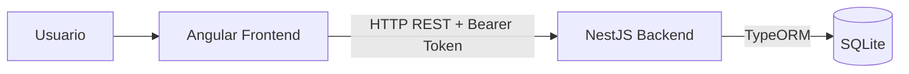
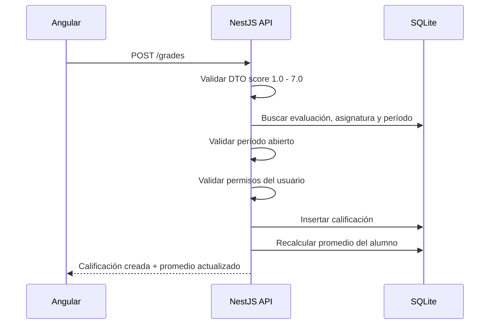
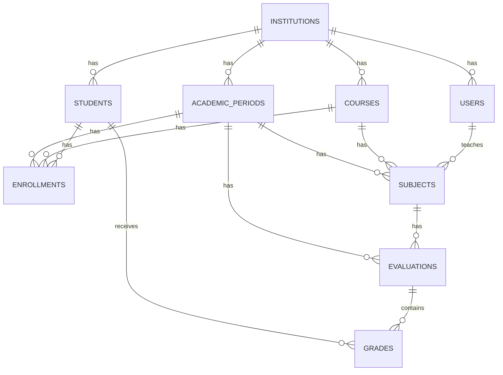

# Taruca — Módulo de Calificaciones

Monorepo fullstack para el módulo de calificaciones de Taruca, una plataforma SaaS orientada a instituciones educativas chilenas.

El proyecto implementa un libro de clases donde profesores y directivos pueden registrar, editar, consultar y analizar calificaciones de alumnos por asignatura y período académico.

---

## Repositorio

Repositorio público: `https://github.com/<usuario>/taruca-calificaciones`

> Reemplazar la URL anterior por la URL final del repositorio antes de enviar la prueba.

---

## Estado de la entrega

Esta versión cubre el alcance obligatorio de la prueba técnica:

- Backend en NestJS con TypeORM y SQLite.
- Frontend en Angular con standalone components.
- Autenticación JWT mockeada con usuario actual, rol e institución.
- CRUD de calificaciones.
- Libro de clases con grilla alumno × evaluación.
- Cálculo de promedio por alumno/asignatura/período.
- Indicación visual de promedio bajo `4.0`.
- Validación de notas entre `1.0` y `7.0` en frontend y backend.
- Bloqueo de modificaciones cuando el período académico está cerrado.
- Permisos diferenciados para director, UTP y profesor.
- Seeds de desarrollo para facilitar la revisión.
- Tests unitarios relevantes en backend y frontend.

### Limitaciones conocidas

- No se implementa login real; se usa JWT mockeado porque la prueba permite simular autenticación.
- No se implementan ponderaciones; el promedio es aritmético simple.
- No se implementa auditoría histórica de cambios en calificaciones.
- No se implementan importaciones o exportaciones masivas.
- No se modelan tipos de evaluación como formativa, sumativa o diagnóstica.

---

## Comandos rápidos

```bash
npm install
npm start
npm test
npm run build
```

URLs locales:

```txt
Frontend: http://localhost:4200
Backend:  http://localhost:3000
SQLite:   backend/data/taruca.sqlite
```

---

## Índice

- [1. Resumen](#1-resumen)
- [2. Stack técnico](#2-stack-técnico)
- [3. Arquitectura](#3-arquitectura)
- [4. Estructura del repositorio](#4-estructura-del-repositorio)
- [5. Ejecución local](#5-ejecución-local)
- [6. Scripts disponibles](#6-scripts-disponibles)
- [7. Variables de entorno](#7-variables-de-entorno)
- [8. Modelo de dominio](#8-modelo-de-dominio)
- [9. Modelo de base de datos SQLite](#9-modelo-de-base-de-datos-sqlite)
- [10. Reglas de negocio](#10-reglas-de-negocio)
- [11. Autenticación y autorización](#11-autenticación-y-autorización)
- [12. API REST](#12-api-rest)
- [13. Frontend](#13-frontend)
- [14. Backend](#14-backend)
- [15. Datos iniciales](#15-datos-iniciales)
- [16. Tests](#16-tests)
- [17. Verificación local](#17-verificación-local)
- [18. Calidad, formato y convenciones](#18-calidad-formato-y-convenciones)
- [19. Decisiones de diseño](#19-decisiones-de-diseño)
- [20. Supuestos](#20-supuestos)
- [21. Qué quedó fuera y mejoras futuras](#21-qué-quedó-fuera-y-mejoras-futuras)
- [22. Checklist de entrega](#22-checklist-de-entrega)
- [23. Guía sugerida para el video](#23-guía-sugerida-para-el-video)

---

## 1. Resumen

El módulo de calificaciones permite gestionar la información académica básica de una institución educativa:

- Períodos académicos abiertos o cerrados.
- Cursos.
- Asignaturas asociadas a curso y período.
- Alumnos inscritos en cursos.
- Evaluaciones, por ejemplo `Prueba 1` o `Control de lectura`.
- Calificaciones numéricas en escala chilena `1.0` a `7.0`.
- Promedios por alumno en una asignatura y período.

Desde la raíz del proyecto se puede levantar frontend y backend con:

```bash
npm install
npm start
```

El frontend consume la API REST del backend usando un token mockeado enviado como `Authorization: Bearer <token>`.

---

## 2. Stack técnico

### Backend

- NestJS
- TypeScript
- TypeORM
- SQLite
- class-validator
- class-transformer
- JWT mockeado
- Jest

### Frontend

- Angular reciente
- Standalone Components
- TypeScript
- Angular Reactive Forms tipados
- RxJS
- HttpClient
- Jasmine/Karma o Jest, según configuración del proyecto

### Monorepo

- npm workspaces
- concurrently
- Node.js
- npm

---

## 3. Arquitectura

La solución se organiza como un monorepo con dos aplicaciones independientes: `backend` y `frontend`.



### Responsabilidad del frontend

El frontend se encarga de la experiencia de usuario:

- Mostrar el libro de clases.
- Permitir ingreso y edición de notas.
- Validar notas antes de enviarlas al backend.
- Mostrar errores de validación y permisos.
- Indicar visualmente promedios bajo `4.0`.
- Consumir la API usando un token JWT mockeado.

### Responsabilidad del backend

El backend concentra la lógica de negocio:

- Validar DTOs.
- Calcular promedios.
- Validar permisos por rol.
- Validar pertenencia a institución.
- Validar que el período esté abierto antes de modificar datos.
- Persistir información en SQLite.
- Exponer endpoints REST.

### Flujo principal: ingreso de una nota



---

## 4. Estructura del repositorio

```txt
tech-testing-profejobs/
├── README.md
├── package.json
├── package-lock.json
├── .gitignore
├── backend/
│   ├── package.json
│   ├── .env.example
│   ├── data/
│   │   └── .gitkeep
│   ├── src/
│   │   ├── main.ts
│   │   ├── app.module.ts
│   │   ├── config/
│   │   │   └── database.config.ts
│   │   ├── auth/
│   │   │   ├── auth.module.ts
│   │   │   ├── guards/
│   │   │   │   └── jwt-auth.guard.ts
│   │   │   ├── decorators/
│   │   │   │   ├── current-user.decorator.ts
│   │   │   │   └── roles.decorator.ts
│   │   │   └── strategies/
│   │   │       └── mock-jwt.strategy.ts
│   │   ├── common/
│   │   │   ├── enums/
│   │   │   │   └── user-role.enum.ts
│   │   │   └── utils/
│   │   │       └── average.util.ts
│   │   ├── institutions/
│   │   ├── users/
│   │   ├── academic-periods/
│   │   ├── courses/
│   │   ├── students/
│   │   ├── subjects/
│   │   ├── evaluations/
│   │   ├── grades/
│   │   ├── gradebook/
│   │   ├── database/
│   │   │   ├── migrations/
│   │   │   └── seeds/
│   │   │       └── seed-dev.ts
│   │   └── health/
│   └── test/
│
└── frontend/
    ├── package.json
    ├── proxy.conf.json
    ├── src/
    │   ├── main.ts
    │   ├── styles.scss
    │   ├── environments/
    │   │   ├── environment.ts
    │   │   └── environment.development.ts
    │   └── app/
    │       ├── app.component.ts
    │       ├── app.routes.ts
    │       ├── core/
    │       │   ├── interceptors/
    │       │   │   └── auth-token.interceptor.ts
    │       │   ├── models/
    │       │   └── services/
    │       │       └── current-user.service.ts
    │       ├── shared/
    │       └── features/
    │           └── gradebook/
    │               ├── pages/
    │               │   └── gradebook-page.component.ts
    │               ├── components/
    │               │   ├── grade-grid.component.ts
    │               │   ├── grade-form.component.ts
    │               │   └── period-status-banner.component.ts
    │               ├── services/
    │               │   ├── gradebook-api.service.ts
    │               │   └── gradebook-state.service.ts
    │               └── models/
    │                   └── gradebook.models.ts
    └── test/
```

---

## 5. Ejecución local

### Requisitos

- Node.js 20 o superior
- npm 10 o superior

No se requiere Docker ni una base de datos externa. SQLite se usa como archivo local.

### Instalación

Desde la raíz:

```bash
npm install
```

### Levantar frontend y backend juntos

Desde la raíz:

```bash
npm start
```

Esto ejecuta ambos servicios en paralelo:

```txt
Backend:  http://localhost:3000
Frontend: http://localhost:4200
```

### Flujo recomendado de revisión

1. Ejecutar `npm install`.
2. Ejecutar `npm start`.
3. Abrir `http://localhost:4200`.
4. Ver el libro de clases precargado.
5. Crear una nota válida.
6. Intentar crear una nota fuera de rango.
7. Editar una nota existente.
8. Cerrar el período académico.
9. Verificar que el sistema bloquea nuevas modificaciones.
10. Ejecutar `npm test`.
11. Ejecutar `npm run build`.

---

## 6. Scripts disponibles

### `package.json` raíz

```json
{
  "name": "taruca-calificaciones",
  "private": true,
  "workspaces": ["backend", "frontend"],
  "scripts": {
    "start": "concurrently -n backend,frontend \"npm run start:backend\" \"npm run start:frontend\"",
    "start:backend": "npm --workspace backend run start:dev",
    "start:frontend": "npm --workspace frontend run start",
    "build": "npm run build:backend && npm run build:frontend",
    "build:backend": "npm --workspace backend run build",
    "build:frontend": "npm --workspace frontend run build",
    "test": "npm run test:backend && npm run test:frontend",
    "test:backend": "npm --workspace backend run test",
    "test:frontend": "npm --workspace frontend run test",
    "lint": "npm run lint:backend && npm run lint:frontend",
    "lint:backend": "npm --workspace backend run lint",
    "lint:frontend": "npm --workspace frontend run lint",
    "format": "npm run format:backend && npm run format:frontend",
    "format:backend": "npm --workspace backend run format",
    "format:frontend": "npm --workspace frontend run format"
  },
  "devDependencies": {
    "concurrently": "^9.0.0"
  }
}
```

### Backend

```bash
npm --workspace backend run start:dev
npm --workspace backend run build
npm --workspace backend run test
npm --workspace backend run test:watch
npm --workspace backend run lint
npm --workspace backend run migration:run
npm --workspace backend run seed
```

### Frontend

```bash
npm --workspace frontend run start
npm --workspace frontend run build
npm --workspace frontend run test
npm --workspace frontend run lint
```

---

## 7. Variables de entorno

### Backend

Crear `backend/.env` a partir de `backend/.env.example`.

```env
PORT=3000
NODE_ENV=development

DATABASE_TYPE=sqlite
DATABASE_PATH=./data/taruca.sqlite
DATABASE_LOGGING=false
DATABASE_SYNCHRONIZE=false

JWT_SECRET=taruca-local-secret
JWT_EXPIRES_IN=1d

CORS_ORIGIN=http://localhost:4200

SEED_ON_BOOTSTRAP=true
```

### Frontend

Archivo sugerido: `frontend/src/environments/environment.development.ts`.

```ts
export const environment = {
  production: false,
  apiUrl: "http://localhost:3000",
  mockToken: "mock-director-token",
};
```

Tokens mockeados disponibles:

```txt
mock-director-token
mock-utp-token
mock-teacher-token
```

---

## 8. Modelo de dominio

El dominio representa una institución educativa, sus usuarios, cursos, asignaturas, alumnos, evaluaciones y calificaciones.

### Institution

Institución educativa dentro de Taruca.

Campos principales:

- `id`
- `name`
- `createdAt`
- `updatedAt`

### User

Usuario perteneciente a una institución.

Campos principales:

- `id`
- `name`
- `email`
- `role`
- `institutionId`
- `createdAt`
- `updatedAt`

Roles:

```ts
export enum UserRole {
  DIRECTOR = "DIRECTOR",
  UTP = "UTP",
  TEACHER = "TEACHER",
}
```

### AcademicPeriod

Período académico, por ejemplo `1er semestre 2025`.

Campos principales:

- `id`
- `name`
- `year`
- `isOpen`
- `institutionId`
- `createdAt`
- `updatedAt`

### Course

Curso de la institución.

Ejemplos:

- `1° Medio A`
- `2° Básico B`

Campos principales:

- `id`
- `name`
- `institutionId`
- `createdAt`
- `updatedAt`

### Student

Alumno de la institución.

Campos principales:

- `id`
- `firstName`
- `lastName`
- `rut`
- `institutionId`
- `createdAt`
- `updatedAt`

### Enrollment

Inscripción de un alumno en un curso durante un período académico.

Esta entidad evita asumir que un alumno siempre pertenece al mismo curso en todos los períodos.

Campos principales:

- `id`
- `studentId`
- `courseId`
- `academicPeriodId`
- `institutionId`
- `createdAt`
- `updatedAt`

### Subject

Asignatura dictada para un curso en un período.

Campos principales:

- `id`
- `name`
- `courseId`
- `academicPeriodId`
- `teacherId`
- `institutionId`
- `createdAt`
- `updatedAt`

### Evaluation

Evaluación o columna del libro de clases.

Ejemplos:

- `Prueba 1`
- `Control de lectura`
- `Trabajo práctico`

Campos principales:

- `id`
- `name`
- `description`
- `subjectId`
- `academicPeriodId`
- `order`
- `createdAt`
- `updatedAt`

### Grade

Nota numérica obtenida por un alumno en una evaluación.

Campos principales:

- `id`
- `studentId`
- `evaluationId`
- `score`
- `createdAt`
- `updatedAt`

La asignatura y el período se obtienen desde la relación con `Evaluation`.

### Nota sobre `Evaluation` vs `Grade`

El enunciado indica que cada calificación puede tener un nombre o descripción, por ejemplo `Prueba 1` o `Control`. En esta solución ese dato se modela en `Evaluation`, no directamente en `Grade`.

La razón es que `Evaluation` representa la columna común del libro de clases, mientras que `Grade` representa únicamente la nota de un alumno para esa evaluación.

Ejemplo:

```txt
Evaluation: Prueba 1
Grade Ana Pérez: 6.5
Grade Juan Soto: 5.8
Grade Camila Rojas: 6.1
```

Esto evita duplicar el texto `Prueba 1` en cada nota, facilita ordenar columnas y mantiene coherencia en la grilla alumno × evaluación.

---

## 9. Modelo de base de datos SQLite

La base de datos local se guarda en:

```txt
backend/data/taruca.sqlite
```

### Diagrama entidad-relación



### Tablas principales

#### `institutions`

| Columna      | Tipo SQLite | Restricciones |
| ------------ | ----------: | ------------- |
| `id`         |        text | PK            |
| `name`       |        text | not null      |
| `created_at` |    datetime | not null      |
| `updated_at` |    datetime | not null      |

#### `users`

| Columna          | Tipo SQLite | Restricciones    |
| ---------------- | ----------: | ---------------- |
| `id`             |        text | PK               |
| `name`           |        text | not null         |
| `email`          |        text | not null, unique |
| `role`           |        text | not null         |
| `institution_id` |        text | FK               |
| `created_at`     |    datetime | not null         |
| `updated_at`     |    datetime | not null         |

#### `academic_periods`

| Columna          | Tipo SQLite | Restricciones          |
| ---------------- | ----------: | ---------------------- |
| `id`             |        text | PK                     |
| `name`           |        text | not null               |
| `year`           |     integer | not null               |
| `is_open`        |     boolean | not null, default true |
| `institution_id` |        text | FK                     |
| `created_at`     |    datetime | not null               |
| `updated_at`     |    datetime | not null               |

#### `courses`

| Columna          | Tipo SQLite | Restricciones |
| ---------------- | ----------: | ------------- |
| `id`             |        text | PK            |
| `name`           |        text | not null      |
| `institution_id` |        text | FK            |
| `created_at`     |    datetime | not null      |
| `updated_at`     |    datetime | not null      |

#### `students`

| Columna          | Tipo SQLite | Restricciones |
| ---------------- | ----------: | ------------- |
| `id`             |        text | PK            |
| `first_name`     |        text | not null      |
| `last_name`      |        text | not null      |
| `rut`            |        text | unique        |
| `institution_id` |        text | FK            |
| `created_at`     |    datetime | not null      |
| `updated_at`     |    datetime | not null      |

#### `enrollments`

| Columna              | Tipo SQLite | Restricciones |
| -------------------- | ----------: | ------------- |
| `id`                 |        text | PK            |
| `student_id`         |        text | FK            |
| `course_id`          |        text | FK            |
| `academic_period_id` |        text | FK            |
| `institution_id`     |        text | FK            |
| `created_at`         |    datetime | not null      |
| `updated_at`         |    datetime | not null      |

Índice único:

```sql
CREATE UNIQUE INDEX idx_enrollments_student_period
ON enrollments (student_id, academic_period_id);
```

#### `subjects`

| Columna              | Tipo SQLite | Restricciones |
| -------------------- | ----------: | ------------- |
| `id`                 |        text | PK            |
| `name`               |        text | not null      |
| `course_id`          |        text | FK            |
| `academic_period_id` |        text | FK            |
| `teacher_id`         |        text | FK users      |
| `institution_id`     |        text | FK            |
| `created_at`         |    datetime | not null      |
| `updated_at`         |    datetime | not null      |

Índice recomendado:

```sql
CREATE INDEX idx_subjects_course_period
ON subjects (course_id, academic_period_id);
```

#### `evaluations`

| Columna              | Tipo SQLite | Restricciones       |
| -------------------- | ----------: | ------------------- |
| `id`                 |        text | PK                  |
| `name`               |        text | not null            |
| `description`        |        text | nullable            |
| `subject_id`         |        text | FK                  |
| `academic_period_id` |        text | FK                  |
| `order`              |     integer | not null, default 0 |
| `created_at`         |    datetime | not null            |
| `updated_at`         |    datetime | not null            |

Índice único recomendado:

```sql
CREATE UNIQUE INDEX idx_evaluations_subject_period_name
ON evaluations (subject_id, academic_period_id, name);
```

#### `grades`

| Columna         | Tipo SQLite | Restricciones |
| --------------- | ----------: | ------------- |
| `id`            |        text | PK            |
| `student_id`    |        text | FK            |
| `evaluation_id` |        text | FK            |
| `score`         |     numeric | not null      |
| `created_at`    |    datetime | not null      |
| `updated_at`    |    datetime | not null      |

Índices recomendados:

```sql
CREATE UNIQUE INDEX idx_grades_student_evaluation
ON grades (student_id, evaluation_id);

CREATE INDEX idx_grades_student
ON grades (student_id);

CREATE INDEX idx_grades_evaluation
ON grades (evaluation_id);
```

### Nota sobre `numeric` en SQLite

SQLite no tiene un tipo decimal estricto como PostgreSQL. Para esta prueba se almacena `score` como `numeric` o `real`, y se refuerza la integridad mediante:

- Validaciones de DTO en NestJS.
- Validaciones de servicio.
- Tests unitarios.
- Restricción opcional `CHECK` en migración.

Restricción recomendada:

```sql
score numeric NOT NULL CHECK(score >= 1.0 AND score <= 7.0)
```

---

## 10. Reglas de negocio

### 10.1 Rango de notas

Una nota válida debe cumplir:

```txt
1.0 <= score <= 7.0
```

Si no cumple, el backend responde `400 Bad Request`.

### 10.2 Promedio

El promedio se calcula como media aritmética simple:

```txt
promedio = suma de notas / cantidad de notas
```

Ejemplo:

```txt
Notas: 5.0, 6.0, 7.0
Promedio: 6.0
```

### 10.3 Sin notas

Si un alumno no tiene calificaciones en una asignatura, el promedio se retorna como `null`.

Se evita retornar `0` porque un cero podría interpretarse como rendimiento académico real.

### 10.4 Redondeo

La API retorna dos valores de promedio:

```json
{
  "average": 5.6666666667,
  "averageRounded": 5.7
}
```

- `average`: valor exacto para cálculos.
- `averageRounded`: valor redondeado a un decimal para mostrar en UI.

### 10.5 Promedio bajo aprobación

La nota mínima de aprobación es:

```txt
4.0
```

Si el promedio es menor a `4.0`, el frontend muestra una alerta visual clara.

### 10.6 Período cerrado

Cuando `academic_periods.is_open = false`, el sistema entra en modo solo lectura para ese período.

Operaciones permitidas:

- Consultar calificaciones.
- Consultar promedios.
- Consultar libro de clases.

Operaciones bloqueadas:

- Crear calificaciones.
- Editar calificaciones.
- Eliminar calificaciones.
- Crear evaluaciones.
- Editar evaluaciones.
- Eliminar evaluaciones.

Respuesta esperada:

```http
403 Forbidden
```

### 10.7 Alumno debe pertenecer al curso de la asignatura

Para crear una nota:

1. Se obtiene la evaluación.
2. Se obtiene la asignatura de la evaluación.
3. Se obtiene el curso de la asignatura.
4. Se valida que el alumno tenga una inscripción en ese curso y período.

Si el alumno no corresponde al curso, se responde:

```http
400 Bad Request
```

### 10.8 Una nota por alumno y evaluación

Un alumno no debe tener dos notas para la misma evaluación.

Se aplica índice único:

```txt
student_id + evaluation_id
```

Si se intenta duplicar, se responde:

```http
409 Conflict
```

### 10.9 Promedio por asignatura y período

El promedio se calcula con todas las notas del alumno asociadas a evaluaciones de la misma asignatura y período.

No se consideran ponderaciones en esta versión.

---

## 11. Autenticación y autorización

La prueba permite mockear token y usuario actual. Por eso el proyecto simula JWT sin implementar login real.

### Tokens disponibles

| Token                 | Usuario        | Rol        |
| --------------------- | -------------- | ---------- |
| `mock-director-token` | Directora Demo | `DIRECTOR` |
| `mock-utp-token`      | Jefa UTP Demo  | `UTP`      |
| `mock-teacher-token`  | Profesor Demo  | `TEACHER`  |

### Header requerido

```http
Authorization: Bearer mock-director-token
```

### Usuario mockeado

Ejemplo:

```ts
{
  id: '11111111-1111-4111-8111-111111111111',
  name: 'Directora Demo',
  email: 'directora@taruca.cl',
  role: 'DIRECTOR',
  institutionId: '00000000-0000-4000-8000-000000000001'
}
```

### Permisos

| Acción                               | Director | UTP | Profesor |
| ------------------------------------ | :------: | :-: | :------: |
| Ver todos los cursos                 |    Sí    | Sí  |    No    |
| Ver sus asignaturas                  |    Sí    | Sí  |    Sí    |
| Ver todas las calificaciones         |    Sí    | Sí  |    No    |
| Gestionar notas de sus asignaturas   |    Sí    | Sí  |    Sí    |
| Gestionar notas de otras asignaturas |    Sí    | Sí  |    No    |
| Abrir/cerrar período                 |    Sí    | Sí  |    No    |

### Validación por institución

Toda consulta se limita a `currentUser.institutionId`.

Esto evita que un usuario de una institución vea información de otra institución.

---

## 12. API REST

La API usa JSON y responde errores con códigos HTTP claros.

### Formato de error

```json
{
  "statusCode": 400,
  "message": ["score must not be greater than 7"],
  "error": "Bad Request"
}
```

### Health check

```http
GET /health
```

Respuesta:

```json
{
  "status": "ok"
}
```

---

### 12.1 Períodos académicos

#### Listar períodos

```http
GET /academic-periods
```

#### Abrir o cerrar período

```http
PATCH /academic-periods/:id/status
```

Body:

```json
{
  "isOpen": false
}
```

Respuestas posibles:

```http
200 OK
403 Forbidden
404 Not Found
```

---

### 12.2 Asignaturas

#### Listar asignaturas visibles para el usuario actual

```http
GET /subjects
```

Query params opcionales:

```txt
courseId
academicPeriodId
```

#### Obtener libro de clases de una asignatura

```http
GET /subjects/:subjectId/gradebook?academicPeriodId=22222222-2222-4222-8222-222222222222
```

Respuesta:

```json
{
  "subject": {
    "id": "66666666-6666-4666-8666-666666666666",
    "name": "Matemática",
    "course": {
      "id": "33333333-3333-4333-8333-333333333333",
      "name": "1° Medio A"
    },
    "academicPeriod": {
      "id": "22222222-2222-4222-8222-222222222222",
      "name": "1er semestre 2025",
      "isOpen": true
    }
  },
  "evaluations": [
    {
      "id": "77777777-7777-4777-8777-777777777777",
      "name": "Prueba 1",
      "description": "Primera prueba de la unidad",
      "order": 1
    }
  ],
  "students": [
    {
      "id": "55555555-5555-4555-8555-555555555555",
      "fullName": "Ana Pérez",
      "grades": [
        {
          "id": "88888888-8888-4888-8888-888888888888",
          "evaluationId": "77777777-7777-4777-8777-777777777777",
          "score": 6.5
        }
      ],
      "average": 6.5,
      "averageRounded": 6.5,
      "isBelowPassingGrade": false
    }
  ]
}
```

---

### 12.3 Evaluaciones

#### Crear evaluación

```http
POST /evaluations
```

Body:

```json
{
  "name": "Prueba 1",
  "description": "Unidad 1",
  "subjectId": "66666666-6666-4666-8666-666666666666",
  "academicPeriodId": "22222222-2222-4222-8222-222222222222",
  "order": 1
}
```

#### Actualizar evaluación

```http
PATCH /evaluations/:id
```

Body:

```json
{
  "name": "Prueba 1 corregida",
  "description": "Unidad 1 y 2"
}
```

#### Eliminar evaluación

```http
DELETE /evaluations/:id
```

Si la evaluación tiene notas asociadas, la eliminación se bloquea y se responde `409 Conflict` para evitar pérdida accidental de información académica.

---

### 12.4 Calificaciones

#### Crear calificación

```http
POST /grades
```

Body:

```json
{
  "studentId": "55555555-5555-4555-8555-555555555555",
  "evaluationId": "77777777-7777-4777-8777-777777777777",
  "score": 6.5
}
```

Respuesta:

```json
{
  "id": "88888888-8888-4888-8888-888888888888",
  "studentId": "55555555-5555-4555-8555-555555555555",
  "evaluationId": "77777777-7777-4777-8777-777777777777",
  "score": 6.5,
  "createdAt": "2025-01-01T12:00:00.000Z",
  "updatedAt": "2025-01-01T12:00:00.000Z"
}
```

#### Listar calificaciones

```http
GET /grades
```

Query params opcionales:

```txt
studentId
subjectId
academicPeriodId
evaluationId
```

#### Obtener detalle

```http
GET /grades/:id
```

#### Actualizar calificación

```http
PATCH /grades/:id
```

Body:

```json
{
  "score": 5.8
}
```

#### Eliminar calificación

```http
DELETE /grades/:id
```

#### Listar calificaciones de un alumno en una asignatura

```http
GET /students/:studentId/subjects/:subjectId/grades?academicPeriodId=22222222-2222-4222-8222-222222222222
```

Respuesta:

```json
[
  {
    "id": "88888888-8888-4888-8888-888888888888",
    "score": 6.5,
    "evaluation": {
      "id": "77777777-7777-4777-8777-777777777777",
      "name": "Prueba 1"
    }
  }
]
```

---

## 13. Frontend

### Pantalla principal: libro de clases

La pantalla principal muestra alumnos en filas y evaluaciones en columnas.

Ejemplo:

| Alumno    | Prueba 1 | Control 1 | Trabajo | Promedio |
| --------- | -------: | --------: | ------: | -------: |
| Ana Pérez |      6.0 |       5.5 |     6.2 |      5.9 |
| Juan Soto |      3.8 |       4.0 |     3.5 |      3.8 |

Cuando el promedio es menor a `4.0`, la fila o celda de promedio se destaca visualmente.

### Estados de UI contemplados

- Cargando datos.
- Error al cargar datos.
- Lista vacía.
- Período abierto.
- Período cerrado.
- Error de validación.
- Error de permisos.
- Guardado exitoso.

### Componentes principales

#### `GradebookPageComponent`

Responsable de:

- Leer curso, asignatura y período seleccionados.
- Cargar el libro de clases.
- Coordinar grilla y formulario.
- Refrescar datos tras crear, editar o eliminar una nota.

#### `GradeGridComponent`

Responsable de:

- Renderizar alumnos.
- Renderizar evaluaciones como columnas.
- Mostrar notas.
- Mostrar promedio.
- Emitir evento de edición de nota.
- Aplicar estilo de riesgo académico cuando el promedio es menor a `4.0`.

#### `GradeFormComponent`

Responsable de:

- Crear o editar calificaciones.
- Usar Reactive Forms tipados.
- Validar rango `1.0` a `7.0`.
- Mostrar mensajes de error claros.

#### `PeriodStatusBannerComponent`

Responsable de:

- Indicar si el período está abierto o cerrado.
- Mostrar modo solo lectura cuando corresponde.

### Servicio API

`GradebookApiService` centraliza las llamadas HTTP:

```ts
getGradebook(subjectId: string, academicPeriodId: string): Observable<GradebookResponse>;

createEvaluation(payload: CreateEvaluationPayload): Observable<Evaluation>;

createGrade(payload: CreateGradePayload): Observable<Grade>;

updateGrade(id: string, payload: UpdateGradePayload): Observable<Grade>;

deleteGrade(id: string): Observable<void>;

setPeriodStatus(periodId: string, isOpen: boolean): Observable<AcademicPeriod>;
```

### Interceptor de autenticación

El frontend agrega el token mockeado automáticamente:

```http
Authorization: Bearer mock-director-token
```

### Validaciones frontend

El formulario valida:

- Nota requerida.
- Nota numérica.
- Nota mayor o igual a `1.0`.
- Nota menor o igual a `7.0`.

Mensaje sugerido:

```txt
La nota debe estar entre 1.0 y 7.0.
```

---

## 14. Backend

### Módulos principales

```txt
AuthModule
AcademicPeriodsModule
SubjectsModule
EvaluationsModule
GradesModule
GradebookModule
```

### `GradesService`

Responsabilidades:

- Crear calificación.
- Actualizar calificación.
- Eliminar calificación.
- Validar rango de nota.
- Validar existencia de alumno y evaluación.
- Validar que el período esté abierto.
- Validar permisos del usuario.
- Evitar duplicados por alumno/evaluación.

### `GradebookService`

Responsabilidades:

- Obtener estudiantes de una asignatura.
- Obtener evaluaciones de la asignatura.
- Obtener notas por estudiante.
- Calcular promedio.
- Armar respuesta optimizada para la grilla.

### DTOs

Los ejemplos usan IDs en formato UUID para ser coherentes con `@IsUUID()`.

#### `CreateGradeDto`

```ts
import { IsNumber, IsUUID, Max, Min } from "class-validator";

export class CreateGradeDto {
  @IsUUID()
  studentId: string;

  @IsUUID()
  evaluationId: string;

  @IsNumber({ maxDecimalPlaces: 1 })
  @Min(1)
  @Max(7)
  score: number;
}
```

#### `UpdateGradeDto`

```ts
import { IsNumber, IsOptional, Max, Min } from "class-validator";

export class UpdateGradeDto {
  @IsOptional()
  @IsNumber({ maxDecimalPlaces: 1 })
  @Min(1)
  @Max(7)
  score?: number;
}
```

#### `CreateEvaluationDto`

```ts
import { IsInt, IsOptional, IsString, IsUUID, Min } from "class-validator";

export class CreateEvaluationDto {
  @IsString()
  name: string;

  @IsOptional()
  @IsString()
  description?: string;

  @IsUUID()
  subjectId: string;

  @IsUUID()
  academicPeriodId: string;

  @IsOptional()
  @IsInt()
  @Min(0)
  order?: number;
}
```

### Códigos de error

| Caso                                  | Código |
| ------------------------------------- | -----: |
| DTO inválido                          |  `400` |
| Nota fuera de rango                   |  `400` |
| Alumno no pertenece al curso          |  `400` |
| Token ausente o inválido              |  `401` |
| Usuario sin permisos                  |  `403` |
| Período cerrado                       |  `403` |
| Recurso no encontrado                 |  `404` |
| Nota duplicada para alumno/evaluación |  `409` |

---

## 15. Datos iniciales

Para facilitar la revisión, el backend carga datos de demostración cuando:

```env
SEED_ON_BOOTSTRAP=true
```

### Institución

```txt
Colegio Taruca Demo
```

### Período

```txt
1er semestre 2025
Estado: abierto
```

### Curso

```txt
1° Medio A
```

### Usuarios

| Nombre         | Rol      | Token                 |
| -------------- | -------- | --------------------- |
| Directora Demo | DIRECTOR | `mock-director-token` |
| Jefa UTP Demo  | UTP      | `mock-utp-token`      |
| Profesor Demo  | TEACHER  | `mock-teacher-token`  |

### Asignatura

```txt
Matemática
Profesor responsable: Profesor Demo
```

### Alumnos

```txt
Ana Pérez
Juan Soto
Camila Rojas
Diego Fernández
Valentina Muñoz
```

### Evaluaciones

```txt
Prueba 1
Control 1
Trabajo práctico
```

### Calificaciones de ejemplo

| Alumno          | Prueba 1 | Control 1 | Trabajo práctico |
| --------------- | -------: | --------: | ---------------: |
| Ana Pérez       |      6.0 |       5.8 |              6.2 |
| Juan Soto       |      3.5 |       4.0 |              3.8 |
| Camila Rojas    |      5.5 |       6.1 |              5.9 |
| Diego Fernández |      4.2 |       3.9 |              4.1 |
| Valentina Muñoz |      6.7 |       6.4 |              6.8 |

Esto permite verificar inmediatamente:

- Promedios calculados.
- Alumnos bajo `4.0`.
- Edición de notas.
- Validaciones.
- Vista de libro de clases.
- Bloqueo de escritura con período cerrado.

---

## 16. Tests

### Backend

Tests del service principal:

```txt
GradesService
  create
    ✓ crea una calificación válida
    ✓ rechaza nota menor que 1.0
    ✓ rechaza nota mayor que 7.0
    ✓ rechaza creación si el período está cerrado
    ✓ rechaza creación si el profesor no pertenece a la asignatura

  calculateAverage
    ✓ calcula correctamente promedio aritmético
    ✓ retorna null si el alumno no tiene notas
```

Tests adicionales:

```txt
GradebookService
  ✓ retorna alumnos con evaluaciones y promedios
  ✓ marca isBelowPassingGrade cuando promedio < 4.0
```

### Frontend

Tests de componentes o servicios principales:

```txt
GradeFormComponent
  ✓ invalida nota menor a 1.0
  ✓ invalida nota mayor a 7.0
  ✓ emite submit con payload correcto cuando el formulario es válido

GradeGridComponent
  ✓ muestra indicador visual cuando el promedio es menor a 4.0
```

### Ejecutar tests

Desde la raíz:

```bash
npm test
```

Backend solamente:

```bash
npm run test:backend
```

Frontend solamente:

```bash
npm run test:frontend
```

---

## 17. Verificación local

Antes de entregar, se recomienda ejecutar los siguientes comandos desde la raíz:

```bash
npm install
npm run build
npm test
```

Resultado esperado:

| Comando         | Resultado esperado                           |
| --------------- | -------------------------------------------- |
| `npm install`   | Instalación sin errores                      |
| `npm run build` | Backend y frontend compilan correctamente    |
| `npm test`      | Tests backend y frontend pasan correctamente |

> Si algún comando falla en el entorno local, actualizar esta sección con la limitación real antes de enviar la prueba.

---

## 18. Calidad, formato y convenciones

### Convenciones de código

- TypeScript estricto donde sea posible.
- DTOs explícitos para entrada y salida.
- Servicios con lógica de negocio.
- Controladores livianos.
- Componentes Angular pequeños y reutilizables.
- Validaciones duplicadas en frontend y backend.
- Nombres consistentes en inglés para código y base de datos.

### Commits sugeridos

Para mostrar proceso ordenado:

```txt
chore: setup monorepo with backend and frontend
feat(backend): add academic domain entities and sqlite config
feat(backend): add grades crud and validations
feat(backend): add gradebook endpoint with averages
feat(backend): add mocked jwt auth and role guards
feat(frontend): add gradebook page and api service
feat(frontend): add grade form with typed validations
test(backend): add grades service unit tests
test(frontend): add grade form validation tests
docs: add architecture and setup instructions
```

### `.gitignore` recomendado

```gitignore
node_modules/
dist/
coverage/
.env
backend/data/*.sqlite
backend/data/*.sqlite-shm
backend/data/*.sqlite-wal
.DS_Store
```

La base SQLite generada no se versiona. En su lugar, se usan seeds reproducibles.

---

## 19. Decisiones de diseño

### 19.1 Monorepo

Se usa monorepo para simplificar la revisión técnica.

Ventajas:

- Un solo repositorio.
- Un solo `npm install`.
- Un solo `npm start`.
- Scripts centralizados.
- Frontend y backend evolucionan juntos.

### 19.2 SQLite

Se usa SQLite porque reduce fricción local.

Ventajas:

- No requiere Docker.
- No requiere instalar PostgreSQL.
- Es suficiente para demostrar modelo, reglas y persistencia.
- Permite crear una base local reproducible con seeds.

En producción se migraría a PostgreSQL.

### 19.3 TypeORM con migraciones

Aunque TypeORM permite `synchronize: true`, se prioriza un esquema estable o migraciones.

Motivos:

- Hace explícito el modelo de base de datos.
- Evita cambios destructivos accidentales.
- Se parece más a un flujo productivo.
- Permite revisar el diseño SQL.

Para desarrollo rápido se puede usar `synchronize: true`, pero no es la opción recomendada para una entrega final.

### 19.4 Evaluaciones separadas de calificaciones

Se agrega la entidad `Evaluation` para representar columnas del libro de clases.

Motivos:

- Una evaluación es común para todo el curso.
- Una calificación es la nota de un alumno en esa evaluación.
- Evita duplicar el texto `Prueba 1` en cada registro de nota.
- Facilita renderizar la grilla alumno × evaluación.
- Permite ordenar columnas.

No se implementa tipo de evaluación ni ponderación.

### 19.5 Promedio simple sin ponderación

El promedio se calcula como media aritmética simple.

Motivos:

- Es lo requerido para el alcance base.
- Evita agregar reglas no solicitadas.
- Mantiene el foco en dominio, permisos, validaciones y experiencia de uso.

### 19.6 JWT mockeado

Se mockea JWT porque el foco de la prueba no es autenticación completa.

La implementación demuestra:

- Guard de autenticación.
- Usuario actual.
- Roles.
- Permisos por institución.
- Permisos por asignatura.

### 19.7 Validación en frontend y backend

La validación está duplicada intencionalmente.

Frontend:

- Mejora la experiencia de usuario.
- Entrega errores inmediatos.

Backend:

- Protege la integridad de los datos.
- Evita datos inválidos si la API se consume directamente.

### 19.8 `average = null` sin notas

Se usa `null` cuando no hay notas.

Motivos:

- `0` podría malinterpretarse como promedio real.
- `null` comunica ausencia de información.
- La UI puede mostrar `Sin notas`.

---

## 20. Supuestos

- Una institución es el límite de acceso de los datos.
- Un usuario pertenece a una sola institución.
- Un profesor solo puede gestionar asignaturas donde está asignado como `teacherId`.
- Director y UTP pueden ver todas las asignaturas de la institución.
- Director y UTP pueden abrir y cerrar períodos.
- Una asignatura pertenece a un curso y a un período.
- Un alumno se inscribe a un curso mediante `Enrollment`.
- Una evaluación pertenece a una asignatura y a un período.
- Una calificación pertenece a un alumno y a una evaluación.
- La nota mínima de aprobación es `4.0`.
- El promedio se calcula sin ponderación.
- El frontend usa un token mockeado configurable.
- Los IDs usados por la API son UUIDs.
- La base SQLite se genera localmente y no se versiona.

---

## 21. Qué quedó fuera y mejoras futuras

### Autenticación real

No se implementa login real.

Con más tiempo:

- Login con email y password.
- Hash de contraseñas.
- Refresh tokens.
- Revocación de sesiones.
- Recuperación de contraseña.

### Ponderaciones

No se implementan ponderaciones.

Con más tiempo se podría agregar:

```txt
Evaluation
- weight
```

El promedio podría calcularse como promedio ponderado.

### Tipos de evaluación

No se modelan tipos como:

- Formativa
- Sumativa
- Diagnóstica

Con más tiempo se agregaría:

```txt
Evaluation.type
```

### Auditoría

No se registra historial de cambios.

Con más tiempo:

```txt
createdBy
updatedBy
deletedBy
deletedAt
```

También se podría crear una tabla `grade_audit_logs`.

### Soft delete

Para la prueba se puede eliminar físicamente.

En producción se recomienda eliminación lógica para mantener trazabilidad académica.

### Importación masiva

Con más tiempo se agregaría importación desde:

- CSV
- Excel
- Plantillas descargables

### Exportación

Se podría agregar exportación del libro de clases a:

- Excel
- PDF
- CSV

### Mejoras UX

Mejoras futuras:

- Filtros por período, curso y asignatura.
- Edición inline completa.
- Atajos de teclado para carga rápida.
- Confirmación antes de eliminar.
- Modo solo lectura más explícito.
- Historial de cambios por nota.
- Toasts de éxito y error.
- Paginación o virtual scroll para cursos grandes.

### Multi-tenant avanzado

El modelo incluye `institutionId`, pero no implementa aislamiento avanzado.

Con más tiempo:

- Guard global de tenant.
- Scopes automáticos por institución.
- Pruebas de aislamiento.
- Índices por `institution_id`.
- Estrategia de auditoría por tenant.

---

## 22. Checklist de entrega

> Este checklist representa el alcance cubierto por la entrega documentada. Si el código publicado no implementa alguno de estos puntos, desmarcarlo antes de enviar el repositorio.

### Backend

- [x] NestJS configurado.
- [x] TypeORM configurado con SQLite.
- [x] Migraciones o esquema estable definido.
- [x] Seeds reproducibles.
- [x] CRUD de calificaciones.
- [x] Endpoint de libro de clases.
- [x] Endpoint de calificaciones por alumno/asignatura.
- [x] Endpoint para abrir/cerrar período.
- [x] Validación de nota entre `1.0` y `7.0`.
- [x] Promedio calculado correctamente.
- [x] Errores `400`, `403`, `404` y `409` donde corresponde.
- [x] Tests unitarios del service principal.

### Frontend

- [x] Angular con standalone components.
- [x] Vista de libro de clases.
- [x] Grilla alumno × evaluación.
- [x] Promedio por alumno.
- [x] Indicador visual de promedio bajo `4.0`.
- [x] Formulario tipado de creación/edición.
- [x] Validación frontend de rango de nota.
- [x] Manejo de estado de carga/error.
- [x] Tests de componente o servicio.

### Repositorio

- [x] `npm install` funciona desde la raíz.
- [x] `npm start` levanta backend y frontend.
- [x] `.env.example` incluido.
- [x] README actualizado.
- [x] Commits ordenados.
- [x] Base SQLite generada localmente, no versionada.
- [x] Proyecto buildable.
- [x] Tests ejecutables.

---

## 23. Guía sugerida para el video

Duración máxima sugerida: 5 minutos.

### 1. Arquitectura general

Explicar brevemente:

- Monorepo.
- Angular frontend.
- NestJS backend.
- SQLite local.
- TypeORM.
- JWT mockeado.

### 2. Modelo de datos

Mostrar:

- Períodos.
- Cursos.
- Asignaturas.
- Alumnos.
- Evaluaciones.
- Calificaciones.
- Promedio.

Destacar que `Evaluation` representa la columna del libro de clases y `Grade` representa la nota del alumno.

### 3. Demo funcional

Mostrar:

- Libro de clases.
- Crear una nota válida.
- Intentar una nota inválida.
- Editar una nota.
- Ver promedio actualizado.
- Ver alumno bajo `4.0`.
- Cerrar período y demostrar bloqueo de escritura.

### 4. Decisiones destacadas

Mencionar:

- SQLite para facilitar evaluación local.
- Monorepo con `npm start`.
- Separación entre evaluación y calificación.
- Validación en frontend y backend.
- Permisos por rol e institución.

### 5. Qué mejoraría con más tiempo

Mencionar:

- Autenticación real.
- Ponderaciones.
- Auditoría.
- Importación/exportación.
- Soft delete.

---

## Licencia

Proyecto desarrollado como parte de una prueba técnica para Taruca.
